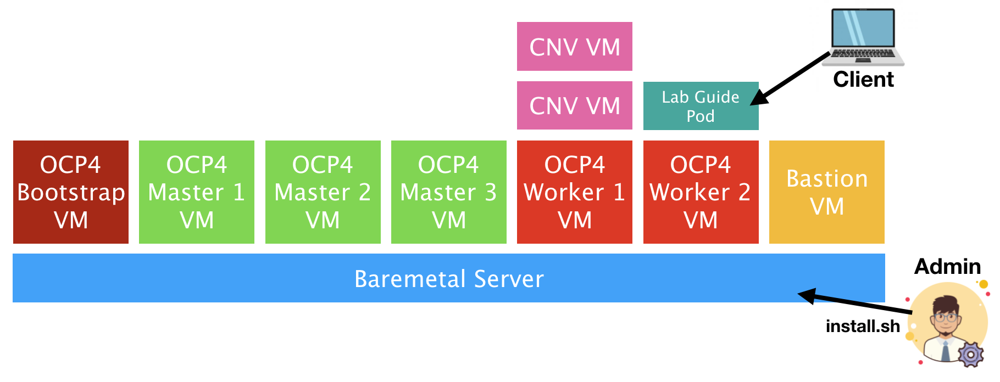
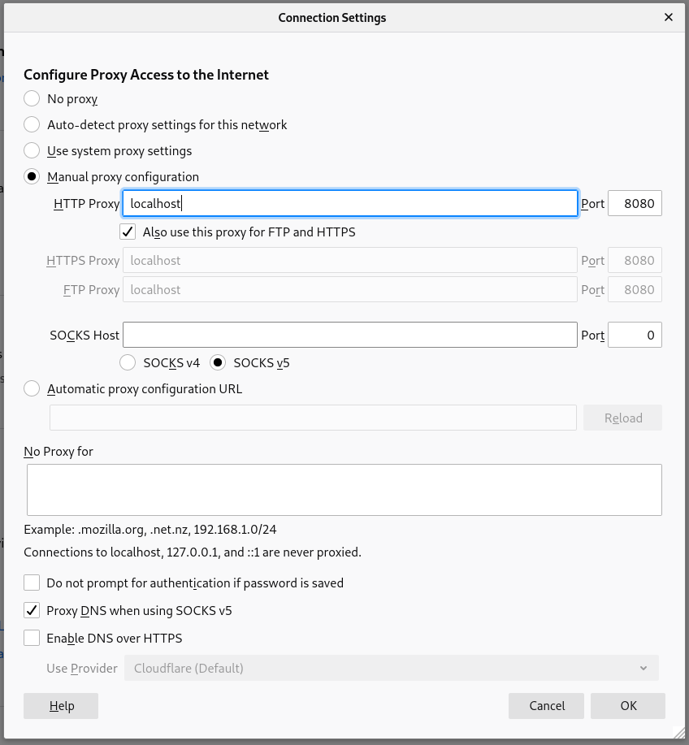
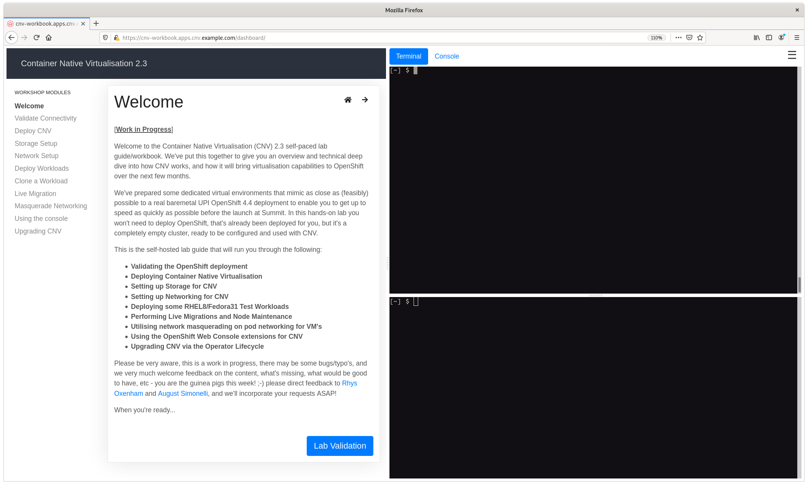

## OpenShift Virtualization Hands-on Lab

**Authors**: [Rhys Oxenham](mailto:roxenham@redhat.com) and [August Simonelli](mailto:asimonel@redhat.com)

Welcome to our hands-on OpenShift Virtualization lab. Right now this repo provides an installation script that builds out an OpenShift 4.5 UPI installation (although the versions can be easily customised) on a single baremetal machine where all of the masters and workers are virtualised. The script also deploys a self-hosted OpenShift Virtualization hands-on self-paced lab guide based on [OpenShift homeroom](https://github.com/openshift-homeroom) - this guide will walk you through deployment of OpenShift Virtualization through to some common usage patterns.

We are going to use the official Red Hat downstream components, where **OpenShift Virtualization** is now the official feature name of the packaged up [Kubevirt project](https://kubevirt.io/) within the OpenShift product. For the purposes of this repo and the labs themselves, any reference to "CNV", "Container-native virtualisation" and "OpenShift Virtualization", and "KubeVirt" can be used interchangeably.

The lab guide runs you through the following tasks -

* **Validating the OpenShift deployment**
* **Deploying OpenShift Virtualization (KubeVirt)**
* **Setting up Storage for OpenShift Virtualization**
* **Setting up Networking for OpenShift Virtualization**
* **Deploying some RHEL 8 / CentOS 8 / Fedora 31 Test Workloads**
* **Performing Live Migrations and Node Maintenance**
* **Utilising network masquerading on pod networking for VM's**
* **Using the OpenShift Web Console extensions for OpenShift Virtualization**

### The Environment

As mentioned above, the entire setup is based on a virtualised infrastructure - we rely on a single (relatively powerful) baremetal node for all of this work; the OpenShift masters and workers are virtual machines themselves, and we run any OpenShift Virtualization virtual machines as nested guests. We do this for simplicity and for ease of scaling this type of enablement, as we have full control over the baremetal machine and we can virtualise networks, storage, host everything we need with no bandwidth/latency concerns, and also means we don't have to worry about sharing access to hardware and the potential conflicts that may arise from doing so.

The deployment is visualised as follows:

    

Here you can see that the admin (or you) runs the `install.sh` script on the baremetal server, and it deploys a number of virtual machines on-top that make up the OpenShift 4.x infrastructure. The deployment script uses the standard "baremetal UPI (user provisioned infrastructure)" model, in that all nodes are somewhat manually provisioned using DHCP/PXE and with no underlying platform integration. This mechanism is slightly more complicated to setup, but is easy to troubleshoot, and the install script takes care of everything for you.

The deployment script then deploys the self-hosted lab guide as a pod on-top of one of the workers and it's that you'll optionally use to follow the step-by-step guide to get familiar with OpenShift Virtualization. The diagram above is somewhat simplified as it omits all of the bastion services, all of the standard OpenShift pods, and also assumes that OpenShift Virtualization has been deployed - the main reason for including OpenShift Virtualization based VM's in the above diagram is to set the context that all VM's launched in the deployment are **nested** guests, i.e. they're virtual machines within virtual machines.

The bastion host is critical to the deployment for a number of reasons; it provides the following services-

* An **HTTP** server to serve up CoreOS ignition files during PXE  deployment
* A **DHCP** server to ensure that we get fixed IP allocation, PXE redirection, and DNS assignment
* A **DNS** (named/bind) server that provides name resolution for *cnv.example.com* and subdomain redirection for **.apps.cnv.example.com* for all deployed application `routes`.
* An **NFS** server to provide access to shared storage for our `persistent volume claims` when we wish to deploy virtual machines on OpenShift Virtualization, and also to act as the storage platform for our image registry.
* A **squid** proxy server so we can point our client browser to the bastion and get all of the required network access we require to the lab, including terminals, OpenShift web-consoles, and access to any additional applications we deploy through their routes.
* A **jump** server to connect to the rest of our infrastructure without requiring us to setup */etc/hosts* on our local client, nor import ssh-keys.

### Hardware Requirements

To run this course your baremetal machine needs to meet the following requirements-

* A single **baremetal** host (right now we don't support multi-host) that's installed with either RHEL 8, CentOS 8, or a recent Fedora release - we've tested with fc31.
* Must have at least **128GB memory** - we've seen it work with 64GB+(large)swap but YMMV
* Must have ~**200GB of SSD**/NVME storage space - it can work with spinning rust but YMMV

### User Requirements

In addition to the hardware requirements, there's a number of things that you'll need to populate in the `install.sh` script before you execute it-

* You need to either have **root** access to the baremetal server, or a user with full **sudo** privileges (without a password)
* The list of image locations that you want to pull - the script could even be used to pull bleeding edge nightlies, which can break, your mileage may vary with these and you may want to play it safe. The parameters to update are `RHCOS_RAMDISK`, `RHCOS_KERNEL`, `RHCOS_RAW`, `OCP_INSTALL` and `OC_CLIENT`. All of these files can be pulled from *mirror.openshift.com*. The filenames are somewhat explanatory, but if you have questions please ask us.
* The location of a vanilla RHEL8 (or CentOS) KVM image (`RHEL8_KVM`) - This will be downloaded (like the other images) when you run the installer. Note that currently if this file already exists in */var/lib/libvirt/images* then it won't download/overwrite it.
* The public ssh-key (`SSH_PUB_BASTION`) that you want to inject into the bastion node so we can execute commands against it without worrying about passwords.
* Your OpenShift *pull secret* so we can pull OpenShift images (`PULL_SECRET`). This is a **json** formatted string with all of the necessary authentication and authorisation secrets and is linked to your specific username/email-address. This can be downloaded from [cloud.redhat.com](https://cloud.redhat.com/) (with instructions [here](https://access.redhat.com/solutions/4844461)).

### Getting Started

If your hardware meets the requirements above, and you've got all of the answers to the user requirements ready, then you're good to go:

~~~bash
$ ssh user@baremetal-server

# git clone https://github.com/rdoxenham/openshift-virt-labs.git
# cd openshift-virt-labs
# vi install.sh
~~~

Once you've made the necessary changes to `install.sh` to match your requirements, simply execute the script - I suggest you run it in tmux/screen though:

~~~bash
# tmux
# ./install.sh
(...)
~~~

If it fails for whatever reason you may be running into situations where we've not done a good enough job of capturing errors - please fix the problems, run `./cleanup.sh` and then try the `./install.sh` again. Please report errors or submit a pull request with updates to the install script to help us capture some of these problems.

During the course of the installation we give some information about what it's doing, and you should see "*Deployment has been successful*" at the end. You should see the following virtual machines running:

~~~bash
# virsh list --all
 Id    Name                           State
----------------------------------------------------
 36    ocp4-bastion                   running
 38    ocp4-master1                   running
 39    ocp4-master2                   running
 40    ocp4-master3                   running
 41    ocp4-worker1                   running
 42    ocp4-worker2                   running
 -     ocp4-bootstrap                 shut off

# exit
logout
~~~

> **NOTE**: It's just fine for the *ocp4-bootstrap* VM to be shut-off, this is just a temporary VM used during the installation of OpenShift 4. It can be deleted if you want, but we remove this during the cleanup stage later.

Once you've received the successful message you're going to need to setup an SSH tunnel to the baremetal machine so we can leverage the **squid** proxy server to *easily* access the OpenShift console, the hosted lab guide, and any other OpenShift routes without us having to worry about DNS. From your workstation, reconnect back to your baremetal server and enable a port forward **from your local machine** to the *bastion* (192.168.123.100) machine where squid runs:

~~~bash
$ ssh user@baremetal-server -L 8080:192.168.123.100:3128
~~~

Once this is up and running, set your browser (we've tested Firefox and had the most success with this - your mileage may vary with other browsers) to use **localhost:8080** for all protocols, and make sure you enable ***DNS over SOCKSv5*** - this avoids any challenges with local DNS:

If all has been well, you can open up the lab guide from your browser that has the proxy server enabled, the URL you need to navigate to is: https://cnv-workbook.apps.cnv.example.com. After a few self-signed certificate approvals you should see the following self-hosted lab guide running on the cluster you just deployed:

> **NOTE**: The two terminals on the right hand side are already pre-configured with the necessary credentials to access the underlying OpenShift cluster, as is the OpenShift Web Console if you select the button above the terminals.

If you want to access the environment outside of the hosted lab guide it's best to use the bastion host as it has all of the necessary credentials setup; **from your baremetal server** execute the following:

~~~bash
# ssh root@192.168.123.100
(no password should be required, if it does use "redhat")

# export KUBECONFIG=~/ocp-install/auth/kubeconfig

# oc get nodes
NAME                           STATUS   ROLES    AGE   VERSION
ocp4-master1.cnv.example.com   Ready    master   28h   v1.17.1
ocp4-master2.cnv.example.com   Ready    master   28h   v1.17.1
ocp4-master3.cnv.example.com   Ready    master   28h   v1.17.1
ocp4-worker1.cnv.example.com   Ready    worker   27h   v1.17.1
ocp4-worker2.cnv.example.com   Ready    worker   27h   v1.17.1
~~~

Furthermore, this is the only node you'll be able to connect to the OpenShift nodes from as it's the one we used to run the installation and therefore the ssh-key has already been imported, for example:

~~~bash
# ssh core@ocp4-master1.cnv.example.com
(no password required)

Red Hat Enterprise Linux CoreOS 44.81.202003230949-0
  Part of OpenShift 4.4, RHCOS is a Kubernetes native operating system
  managed by the Machine Config Operator (`clusteroperator/machine-config`).

WARNING: Direct SSH access to machines is not recommended; instead,
make configuration changes via `machineconfig` objects:
  https://docs.openshift.com/container-platform/4.4/architecture/architecture-rhcos.html

---
[core@ocp4-master1 ~]$
~~~

Good luck and let us know if you have any questions/challenges... :-)

### Contributing

Currently there's two elements to this project -

1. The install scripts for an "*all in one*" baremetal environment as described above
2. The self-hosted lab guide for (1) found in ***docs/***

Hacking on the install script is relatively straight forward of course, but hacking on the documentation is a little more complicated. You can, of course, just edit the files in a Markdown editor of your choosing (I really like [Typora](https://typora.io/) for Linux and [Macdown](https://macdown.uranusjr.com/) for MacOS), but actually seeing how they'll look in the self-hosted lab guide and to test things properly, I'd encourage you to build them on a target platform. In other words, deploy with the `install.sh` script as normal, then take the following actions:

~~~bash
$ ssh user@baremetal-server
(...)

$ ssh root@192.168.123.100
(no password required)

# export KUBECONFIG=~/ocp-install/auth/kubeconfig
# oc project workbook
Now using project "workbook" on server "https://api.cnv.example.com:6443".

# git clone https://github.com/rdoxenham/openshift-virt-labs.git
(or clone your specific branch)

# cd openshift-virt-labs/docs
(make any changes you need to / copy your files in)

# oc start-build cnv --from-dir=.
Uploading directory "." as binary input for the build ...
...
Uploading finished
build.build.openshift.io/cnv-2 started

# oc get pods
NAME          READY   STATUS    RESTARTS   AGE
cnv-1-4gk8p   2/2     Running   0          41h
cnv-2-build   1/1     Running   0          31s

(after a few minutes)

# # oc get pods
NAME           READY   STATUS      RESTARTS   AGE
cnv-2-build    0/1     Completed   0          4m18s
cnv-2-deploy   0/1     Completed   0          2m53s
cnv-2-vbmmb    2/2     Running     0          2m46s
~~~

When you start this new build it triggers a build and then a re-deployment of the latest version of the code. It'll terminate the older pods and the latest code will be served at the normal route [https://cnv-workbook.apps.cnv.example.com](https://cnv-workbook.apps.cnv.example.com). Do note, however, any existing sessions to the lab guide that you had before will be dropped.

**We very much welcome contributions and pull requests!**