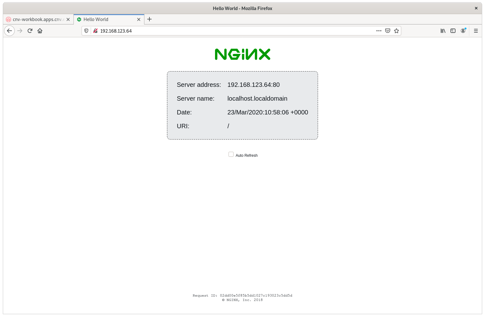
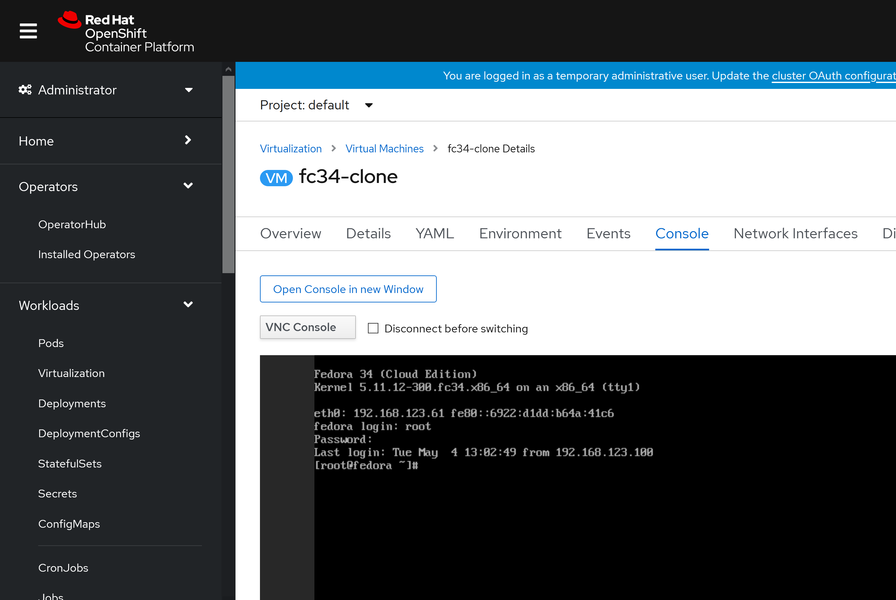
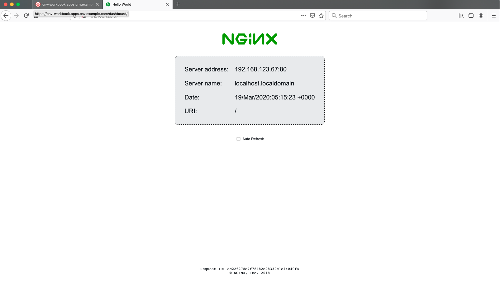

In this lab we're going to clone a workload and prove that it's identical to the previous. For convenience we're going to download and customise a Fedora 31 image, launch a virtual machine via OpenShift virtualisation based on it, and then clone it - we'll then test to see if the cloned machine works as expected. Before we begin we need to setup our Fedora 31 cloud image, let's first connect to our bastion host as we need somewhere to process and serve the image:

~~~bash
$ ssh root@ocp4-bastion
(password is "redhat")
~~~

Change directory to `/var/www/html` and download the latest Fedora 31 cloud image there:

~~~bash
# cd /var/www/html

# wget https://download.fedoraproject.org/pub/fedora/linux/releases/34/Cloud/x86_64/images/Fedora-Cloud-Base-34-1.2.x86_64.raw.xz
(...)

# xz -d Fedora-Cloud-Base-34-1.2.x86_64.raw.xz
(no output but may take a minute)

# ls -l | grep -i fedora
-rw-r--r--. 1 root root  5368709120 Apr 23 10:59 Fedora-Cloud-Base-34-1.2.x86_64.raw
~~~

Now we need to customise this image, we're going to do the following:

* Permit root login over ssh
* Reset the root password to "redhat"

~~~bash
# dnf install libguestfs-tools -y
(...)

# systemctl enable --now libvirtd

# virt-customize -a /var/www/html/Fedora-Cloud-Base-34-1.2.x86_64.raw --run-command 'sed -i s/^#PermitRootLogin.*/PermitRootLogin\ yes/ /etc/ssh/sshd_config'

[   0.0] Examining the guest ...
(...)

# virt-customize -a /var/www/html/Fedora-Cloud-Base-34-1.2.x86_64.raw --uninstall=cloud-init --root-password password:redhat --ssh-inject root:file:/root/.ssh/id_rsa.pub

[   0.0] Examining the guest ...
(...)

# exit
logout
Connection to ocp4-bastion closed.
~~~

> **NOTE**: Make sure that you've disconnected from this machine before proceeding.

Now that we've prepared our Fedora 31 VM and placed it on an accessible location on our bastion host: (for reference it's at: http://192.168.123.100:81/Fedora-Cloud-Base-34-1.2.x86_64.raw). 

Let's build a PV that will eventually house a copy of this image so we can build a VM from it afterwards:

~~~bash
$ cat << EOF | oc apply -f -
apiVersion: v1
kind: PersistentVolume
metadata:
  name: fc34-pv
spec:
  accessModes:
  - ReadWriteOnce
  - ReadWriteMany
  capacity:
    storage: 10Gi
  nfs:
    path: /nfs/fc31
    server: 192.168.123.100
  persistentVolumeReclaimPolicy: Delete
  storageClassName: nfs
  volumeMode: Filesystem
EOF

persistentvolume/fc34-pv created
~~~

And make sure the volume is `Available`:

~~~bash
 $ oc get pv/fc34-pv
NAME                                       CAPACITY   ACCESS MODES   RECLAIM POLICY   STATUS      CLAIM
                      STORAGECLASS           REASON   AGE
fc34-pv                                    10Gi       RWO,RWX        Delete           Available
                      nfs                             20s
~~~

Next we need to create a PVC for that PV that utilises the CDI utility to get the Fedora image from the endpoint we placed it on. The syntax should be familiar to you now with the `cdi.kubevirt.io/storage.import.endpoint` annotation indicating the endpoint for CDI to import from.

~~~bash
$ cat << EOF | oc apply -f -
apiVersion: v1
kind: PersistentVolumeClaim
metadata:
  name: "fc34-nfs"
  labels:
    app: containerized-data-importer
  annotations:
    cdi.kubevirt.io/storage.import.endpoint: "http://192.168.123.100:81/Fedora-Cloud-Base-34-1.2.x86_64.raw"
spec:
  volumeMode: Filesystem
  storageClassName: nfs
  accessModes:
  - ReadWriteMany
  resources:
    requests:
      storage: 10Gi
EOF

persistentvolumeclaim/fc34-nfs created
~~~

As before we can watch the process and see the pods (you'll need to be quick with the next two commands, as it's only a 10GB image):

~~~bash
$ oc get pod/importer-fc34-nfs
NAME                                        READY   STATUS    RESTARTS   AGE
importer-fc34-nfs                           1/1     Running   0          5s
~~~

The import:

~~~bash
$ oc logs importer-fc34-nfs -f
I0319 02:41:06.647561       1 importer.go:51] Starting importer
I0319 02:41:06.651389       1 importer.go:107] begin import process
I0319 02:41:06.654768       1 data-processor.go:275] Calculating available size
I0319 02:41:06.656489       1 data-processor.go:283] Checking out file system volume size.
I0319 02:41:06.656689       1 data-processor.go:287] Request image size not empty.
I0319 02:41:06.656704       1 data-processor.go:292] Target size 10Gi.
I0319 02:41:06.657272       1 data-processor.go:205] New phase: TransferDataFile
I0319 02:41:06.660080       1 util.go:170] Writing data...
I0319 02:41:07.657584       1 prometheus.go:69] 17.53
I0319 02:41:08.657711       1 prometheus.go:69] 17.53
I0319 02:41:09.678442       1 prometheus.go:69] 24.25
~~~

A stripped down importer description, noting that it's unlikely that you'll be able to execute this command unless you're very quick!

~~~bash
$ oc describe pod $(oc get pods | awk '/importer/ {print $1;}')
Name:         importer-fc34-nfs
Namespace:    default
Priority:     0
Node:         ocp4-worker2.cnv.example.com/192.168.123.105
Start Time:   Thu, 19 Mar 2020 02:41:03 +0000
Labels:       app=containerized-data-importer
              cdi.kubevirt.io=importer
              cdi.kubevirt.io/storage.import.importPvcName=fc34-nfs
              prometheus.cdi.kubevirt.io=
Annotations:  cdi.kubevirt.io/storage.createdByController: yes
              k8s.v1.cni.cncf.io/networks-status:
(...)
    Environment:
      IMPORTER_SOURCE:       http
      IMPORTER_ENDPOINT:     http://192.168.123.100:81/Fedora-Cloud-Base-34-1.2.x86_64.raw
      IMPORTER_CONTENTTYPE:  kubevirt
      IMPORTER_IMAGE_SIZE:   10Gi
      OWNER_UID:             6cf06f28-7056-40e8-bb8b-2bac5abbe363
      INSECURE_TLS:          false
    Mounts:
      /data from cdi-data-vol (rw)
      /var/run/secrets/kubernetes.io/serviceaccount from default-token-crznj (ro)
(...)
Volumes:
  cdi-data-vol:
    Type:       PersistentVolumeClaim (a reference to a PersistentVolumeClaim in the same namespace)
    ClaimName:  fc34-nfs
    ReadOnly:   false
(...)
~~~

And finally our working PVC:

~~~bash
$ oc get pvc/fc34-nfs
NAME             STATUS   VOLUME                                     CAPACITY   ACCESS MODES   STORAGECLASS           AGE
fc34-nfs         Bound    fc34-pv                                    10Gi       RWO,RWX        nfs                    2m13s
~~~

### Fedora 34 Virtual Machine

Now it's time to launch our Fedora VM. Again we are just using the same pieces we've been using throughout the labs. For review we are using the `fc34-nfs` PVC we just prepared (created with CDI importing the Fedora image, stored on NFS), and we are utilising the standard bridged networking on the workers via the `tuning-bridge-fixed` construct - the same as we've been using for the other two virtual machines:

~~~bash
$ cat << EOF | oc apply -f -
apiVersion: kubevirt.io/v1alpha3
kind: VirtualMachine
metadata:
  name: fc34-nfs
  labels:
    app: fc34-nfs
    flavor.template.kubevirt.io/small: 'true'
    os.template.kubevirt.io/fedora31: 'true'
    vm.kubevirt.io/template-namespace: openshift
    workload.template.kubevirt.io/server: 'true'
spec:
  running: true
  template:
    metadata:
      labels:
        flavor.template.kubevirt.io/small: 'true'
        kubevirt.io/size: small
        os.template.kubevirt.io/fedora33: 'true'
        vm.kubevirt.io/name: fc34-nfs
        workload.template.kubevirt.io/server: 'true'
    spec:
      domain:
        cpu:
          cores: 1
          sockets: 1
          threads: 1
        devices:
          autoattachPodInterface: false
          disks:
            - bootOrder: 1
              disk:
                bus: virtio
              name: disk0
          interfaces:
            - bridge: {}
              model: virtio
              name: nic0
          networkInterfaceMultiqueue: true
          rng: {}
        machine:
          type: pc-q35-rhel8.1.0
        resources:
          requests:
            memory: 2Gi
      evictionStrategy: LiveMigrate
      hostname: fc34-nfs
      networks:
        - multus:
            networkName: tuning-bridge-fixed
          name: nic0
      terminationGracePeriodSeconds: 0
      volumes:
        - name: disk0
          persistentVolumeClaim:
            claimName: fc34-nfs
EOF

virtualmachine.kubevirt.io/fc34-nfs created    
~~~

We can view the running VM:

~~~bash
 $ oc get vmi/fc34-nfs
NAME                    AGE     PHASE     IP                  NODENAME
fc34-nfs                28m     Running                       ocp4-worker2.cnv.example.com
~~~

> **NOTE:** The IP address for the Fedora 31 virtual machine will be missing as the `qemu-guest-agent` isn't installed by default, but it should still have networking access. We'll need to utilise the console to get these next steps finalised.

Navigate to the OpenShift UI so we can access the console of the `fc34-nfs` virtual machine. You'll need to select "**Workloads**" --> "**Virtual Machines**" --> "**fc34-nfs**" --> "**Consoles**". You'll be able to login with "**root/redhat**", noting that you may have to click on the console window for it to capture your input. Tip: You might find `Serial Console` option is more responsive.

> **NOTE** If you don't see an VMs make sure to change to the Default project via the drop down at the top of the console.

Once you're in the virtual machine let's install the `qemu-guest-agent` package so we can easily see the IP address of the machine (and the eventual clone):

> **NOTE**: In some cases we've seen DNS not being setup correctly on this Fedora31 guest and some of the above commands failing, simply set the nameserver to "8.8.8.8" on this machine - we only need to download a few packages. If you see this just run `echo "nameserver 8.8.8.8" > /etc/resolv.conf`. Then retry the package install.

~~~bash
Ensure the SELinux permissions on sshd are OK by running

~~~bash
[root@localhost ~]# restorecon -Rv /etc/ssh/sshd_config

Relabeled /etc/ssh/sshd_config from system_u:object_r:unlabeled_t:s0 to system_u:object_r:etc_t:s0
~~~

And then exit the shell:

~~~bash
[root@localhost ~]# logout
~~~

Now if we return to our lab terminal we should be able to see the IP address of the Fedora 31 machine via the OpenShift API; if so, let's try ssh'ing to it:

~~~bash
$ oc get vmi/fc34-nfs
NAME       AGE     PHASE     IP               NODENAME
fc34-nfs   7m54s   Running   192.168.123.60   ocp4-worker2.cnv.example.com

$ ssh root@192.168.123.60
(the password is "redhat")

[root@localhost ~]#
~~~

Let's install `nginx` via `systemd` and `podman`, i.e. have *systemd* call *podman* to start an *nginx* container at boot time:

~~~bash
[root@localhost ~]# dnf install podman -y

Last metadata expiration check: 0:38:21 ago on Thu 19 Mar 2020 03:42:07 AM UTC.
Dependencies resolved.
==================================================================================================================================================================================
 Package                                             Architecture                   Version                                                 Repository                       Size
==================================================================================================================================================================================
Installing:
 podman                                              x86_64                         2:1.8.1-2.fc31                                          updates                          13 M
(...)

[root@localhost ~]# cat >> /etc/systemd/system/nginx.service << EOF
[Unit]
Description=Nginx Podman container
Wants=syslog.service
[Service]
ExecStart=/usr/bin/podman run --net=host docker.io/nginxdemos/hello:latest
ExecStop=/usr/bin/podman stop --all
[Install]
WantedBy=multi-user.target
EOF

[root@localhost ~]# systemctl enable --now nginx

Created symlink /etc/systemd/system/multi-user.target.wants/nginx.service → /etc/systemd/system/nginx.service.

[root@localhost ~]# systemctl status nginx
● nginx.service - Nginx Podman container
   Loaded: loaded (/etc/systemd/system/nginx.service; enabled; vendor preset: disabled)
   Active: active (running) since Tue 2020-03-31 01:30:48 UTC; 8s ago
 Main PID: 9898 (podman)
    Tasks: 11 (limit: 2345)

(should see "active (running)" in green above)

[root@localhost ~]# logout
Connection to 192.168.123.64 closed.

$
~~~

Let's quickly verify that this works as expected - you should be able to navigate directly to the IP address of your machine in your browser - recalling that in my example it's *192.168.123.60*, it may be different for you, but unlikely if you've not created any additional VM's along the way:

> **NOTE**: These steps are important for both this lab and a future one; please ensure they complete correctly.

We need to shutdown the VM so we can clone it without risking filesystem corruption, but for us to do that we need to change some of the default behaviour of our virtual machine to stop OpenShift and OpenShift virtualisation from automatically restarting our VM if we do try to shut it down. We need to remove the `running: true` line, and replace it with `runStrategy: RerunOnFailure` within the the `vm` object:

~~~bash
$ oc edit vm/fc34-nfs
(...)

1. Remove the line containing "running: true"
2. Replace it with "runStrategy: RerunOnFailure"
3. Save the file and exit the editor

virtualmachine.kubevirt.io/fc34-nfs edited
~~~

> **NOTE**: You can prefix the `oc edit` command with "`EDITOR=<your favourite editor>`" if you'd prefer to use something other than vi to do this work. Also note that "ReRunOnFailure" simply means that OpenShift virtualisation will do its best to automatically restart this VM if a failure has occurred, but won't always enforce it to be running, e.g. if the user shuts it down

Now reopen the  ssh-session to the Fedora 34 machine and power it off:

~~~bash
$ oc get vmi/fc34-nfs
NAME       AGE   PHASE     IP                  NODENAME
fc31-nfs   18m   Running   192.168.123.60/24   ocp4-worker1.cnv.example.com

$ ssh root@192.168.123.60
(password is "redhat")

[root@localhost ~]# poweroff
[root@localhost ~]# Connection to 192.168.123.60 closed by remote host.
Connection to 192.168.123.60 closed.
~~~

Now if you check the list of `vmi` objects you should see that it's marked as `Succeeded` rather than being automatically restarted by OpenShift virtualisation:

~~~bash
$ oc get vmi
NAME                    AGE   PHASE       IP                  NODENAME
fc34-nfs                19m   Succeeded   192.168.123.65/24   ocp4-worker1.cnv.example.com
rhel8-server-hostpath   91m   Running     192.168.123.63/24   ocp4-worker1.cnv.example.com
rhel8-server-nfs        94m   Running     192.168.123.62/24   ocp4-worker1.cnv.example.com
~~~

### Clone the VM

Now that we've got a working virtual machine with a test workload we're ready to actually clone it, to prove that the built-in cloning utilities work, and that the cloned machine shares the same workload. First we need to create a PV (persistent volume) to clone into. This is done by creating a special resource called a `DataVolume`, this custom resource type is provide by CDI. DataVolumes orchestrate import, clone, and upload operations and help the process of importing data into a cluster. DataVolumes are integrated into OpenShift virtualisation.

The volume we are creating is named `fc34-clone`, we'll be pulling the data from the volume ("source") `fc34-nfs` and we'll tell the CDI to provision onto a specific node. We're only using this option to demonstrate the annotation, but also because we're going to clone from an NFS-based volume onto a hostpath based volume; this is important because hostpath volumes are not shared-storage based, so the location you specify here is important as that's exactly where the cloned VM will have to run:

~~~bash
$ cat << EOF | oc apply -f -
apiVersion: cdi.kubevirt.io/v1alpha1
kind: DataVolume
metadata:
  name: fc34-clone
  annotations:
    volume.kubernetes.io/selected-node: ocp4-worker2.cnv.example.com                        
spec:
  source:
    pvc:
      namespace: default
      name: fc34-nfs
  pvc:
    accessModes:
      - ReadWriteOnce
    storageClassName: hostpath-provisioner
    resources:
      requests:
        storage: 20Gi
EOF

datavolume.cdi.kubevirt.io/fc34-clone created
~~~

You can watch the progress with where it will go through `CloneScheduled` and `CloneInProgress` phases along with a handy status precentage:

~~~bash
$ watch -n5 oc get datavolume
Every 5.0s: oc get datavolume

NAME         PHASE            PROGRESS   AGE
fc34-clone   CloneScheduled              39s
(...)

NAME         PHASE             PROGRESS   AGE
fc34-clone   CloneInProgress   27.38%     2m46s
(...)

NAME         PHASE       PROGRESS   AGE
fc34-clone   Succeeded   100.0%     3m13s

(Ctrl-C to stop/quit)
~~~

> **NOTE**: It may take a few minutes for the clone to start as it's got to pull the CDI clone images down too.

View all your PVCs, and the new clone:

~~~bash
$ oc get pvc
NAME             STATUS   VOLUME                                     CAPACITY   ACCESS MODES   STORAGECLASS           AGE
fc34-clone       Bound    pvc-f3b17f37-1afc-4d55-8caa-a44b34efda2c   79Gi       RWO            hostpath-provisioner   4m15s
fc34-nfs         Bound    fc34-pv                                    10Gi       RWO,RWX        nfs                    74m
rhel8-hostpath   Bound    pvc-62e166e0-ddd4-4b40-8cb1-89ee8ee7dfed   79Gi       RWO            hostpath-provisioner   167m
rhel8-nfs        Bound    nfs-pv1                                    40Gi       RWO,RWX        nfs                    26h
~~~

### Start the cloned VM

Finally we can start up a new VM using the cloned PVC:

~~~bash
$ cat << EOF | oc apply -f -
apiVersion: kubevirt.io/v1alpha3
kind: VirtualMachine
metadata:
  name: fc34-clone
  labels:
    app: fc34-clone
    flavor.template.kubevirt.io/small: 'true'
    os.template.kubevirt.io/fedora31: 'true'
    vm.kubevirt.io/template-namespace: openshift
    workload.template.kubevirt.io/server: 'true'
spec:
  running: true
  template:
    metadata:
      labels:
        flavor.template.kubevirt.io/small: 'true'
        kubevirt.io/size: small
        os.template.kubevirt.io/fedora33: 'true'
        vm.kubevirt.io/name: fc34-clone
        workload.template.kubevirt.io/server: 'true'
    spec:
      domain:
        cpu:
          cores: 1
          sockets: 1
          threads: 1
        devices:
          autoattachPodInterface: false
          disks:
            - bootOrder: 1
              disk:
                bus: virtio
              name: disk0
          interfaces:
            - bridge: {}
              model: virtio
              name: nic0
          networkInterfaceMultiqueue: true
          rng: {}
        machine:
          type: pc-q35-rhel8.1.0
        resources:
          requests:
            memory: 2Gi
      evictionStrategy: LiveMigrate
      hostname: fc31-clone
      networks:
        - multus:
            networkName: tuning-bridge-fixed
          name: nic0
      terminationGracePeriodSeconds: 0
      volumes:
        - name: disk0
          persistentVolumeClaim:
            claimName: fc34-clone
EOF

virtualmachine.kubevirt.io/fc34-clone created
~~~

After a few minutes you should see the new virtual machine running:

~~~bash
$ oc get vmi
NAME                    AGE     PHASE       IP                  NODENAME
NAME               AGE    PHASE       IP                NODENAME
fc34-clone         59s    Running     192.168.123.61    ocp4-worker2.cnv.example.com
fc34-nfs           50m    Succeeded   192.168.123.60    ocp4-worker2.cnv.example.com
rhel8-server-nfs   153m   Running     192.168.178.117   ocp4-worker2.cnv.example.com
~~~

> **Note** Give the command 2-3 minutes to report the IP. 

This machine will also be visible from the console, and you can login using "**root/redhat**" just like before:

### Test the clone

Connect your browser to http://192.168.123.61/ (noting that your IP from the clone and that your IP may be different) and you should find the **ngnix** server you configured on the original host, prior to the clone, pleasantly serving your request:

That's it! You've proven that your clone has worked, and that the hostpath based volume is an identical copy of the original NFS-based one.

### Clean up

Before moving on to the next lab let's clean up the VMs so we ensure our environment has all the resources it might need; we're going to delete our Fedora VMs and our RHEL8 hostpath VM:

~~~bash
$ oc delete vm/fc34-clone vm/fc34-nfs vm/rhel8-server-hostpath
virtualmachine.kubevirt.io "fc34-clone" deleted
virtualmachine.kubevirt.io "fc34-nfs" deleted
virtualmachine.kubevirt.io "rhel8-server-hostpath" deleted
~~~

> **NOTE**: If you check `oc get vmi` too quickly you might see the VMs in a `Failed` state. This is normal and when you check again they should disappear accordingly.

~~~bash
$ oc get vmi
NAME               AGE   PHASE     IP                  NODENAME
rhel8-server-nfs   23h   Running   192.168.123.62/24   ocp4-worker1.cnv.example.com
~~~

