Now that you've had a chance to dive into how OpenShift virtualisation works at a very deep level, let's spend a little time looking at an equally important component of the OpenShift virtualisation experience: the User Interface (UI). As with all Red Hat products OpenShift virtualisation offers a rich CLI allowing administrators to easily script repetitive actions, dive deep into components, and create almost infinite levels of configuration. In these labs you've use both `virtctl`, the OpenShift virtualisation client, and `oc`, the OpenShift Container Platform client, to do many tasks.

However, the need for an easy to use, developer friendly User Experience is also a key value for OpenShift and OpenShift virtualisation. Let's take a look at some of the outcomes and actions from the previous labs and how they can be achived and/or reviewed from within OpenShift's exceptional UI.

### Connecting to the console
As you've probably found already you can view the OpenShift console by clicking on the "Console" link in the lab's environment:

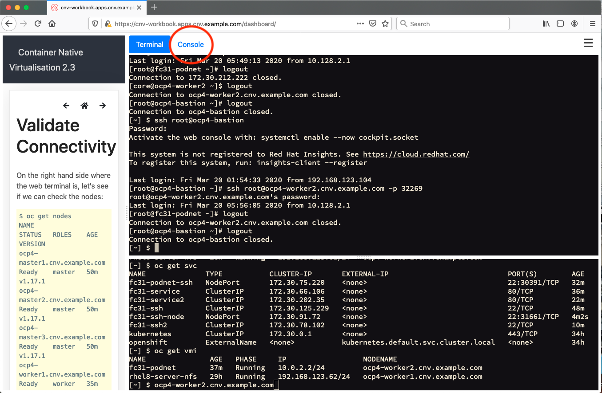

This brings up the familiar OpenShift console with the lab text to the side. You may need to adjust the panes to ensure you can see all the panels.

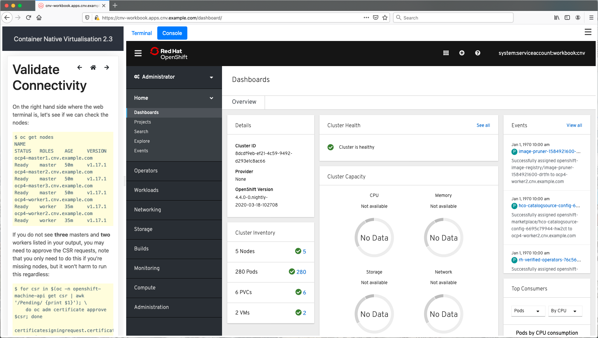

### Virtual Machines in OpenShift!

Once OpenShift virtualisation is installed options for Virtual Machines will appear under the Workloads section. And once you have running VM's they are added for easy access from the "Cluster Inventory" Panel:

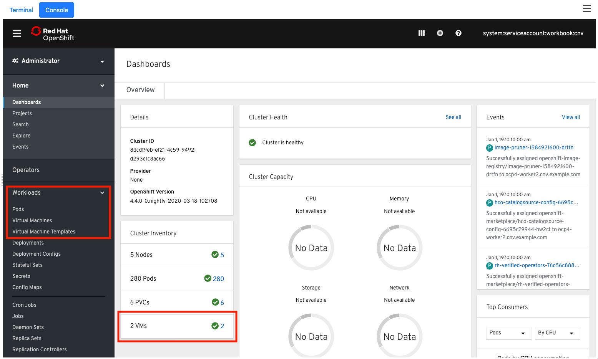

Choose "**Virtual Machines**" from the "**Workloads**" menu and you will see the running VMs from the labs. Click on the link for the "**rhel8-server-nfs**" instance. You can see some of the familiar features of this instance, such as the IP, node, OS, and more.

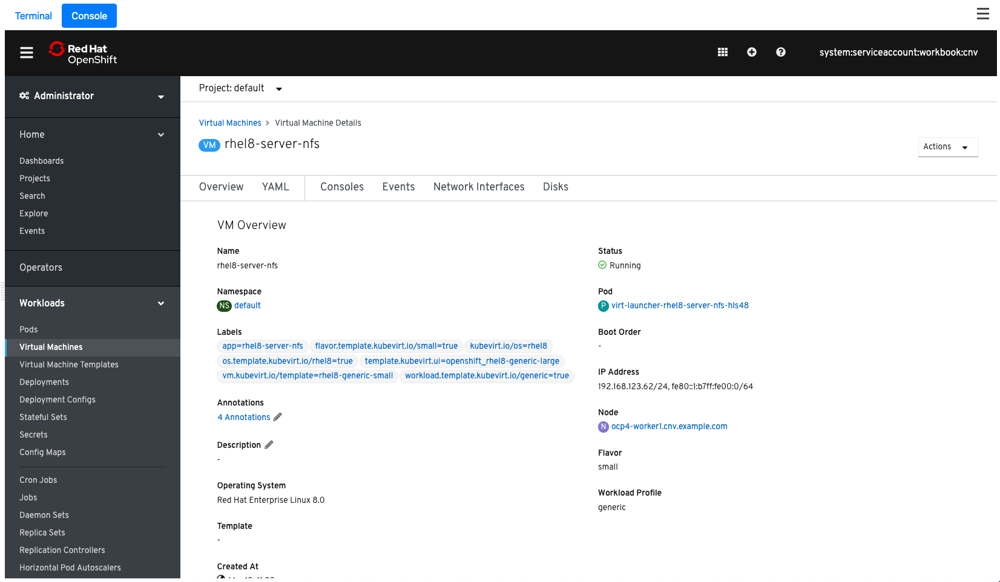

Across the top is a helpful menu allowing you deeper access to administer and access the running VM. Choose `YAML` to view, edit, and reload the template defining this instance. `Consoles` give you access, via both VNC and Serial to the instance's console for easy login. `Events` display, of course, important events for the instance. With `Network Interfaces` we can see the name, model, binding, etc for the instances network connections. Under `Disks` we can see the storage class used and the type of interface. Be sure to look at the different entries for different types of virtual machines. You should be able to directly connect the names, values, and information to the services and objects you created before.

But it's not just the VM instances available. OpenShift virtualisation is merely an extension to OpenShift and all the components we created and used for our VMs are part of the OpenShift experience just like they are for pods. On the menu on the left choose "**Networking**" and select "**Services**":

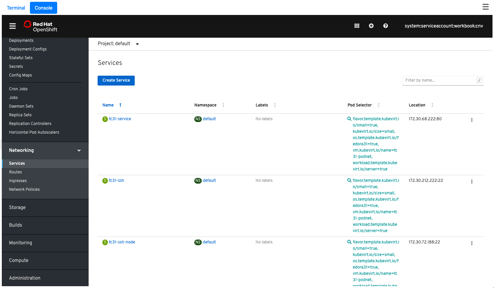

Here you can see the networking services we created for our Fedora 31 host for **http**, **ssh**, and  **NodePort SSH**. Try drilling down on the `fc31-service` Service. You should see all the features of the service  including Cluster IP, port mapping, and routing. From the actions menu in the upper right corner you can edit these values directly and update your VM's service directly from the UI, in the same was as you can do with pods.

Next click on the `Pods` menu item:

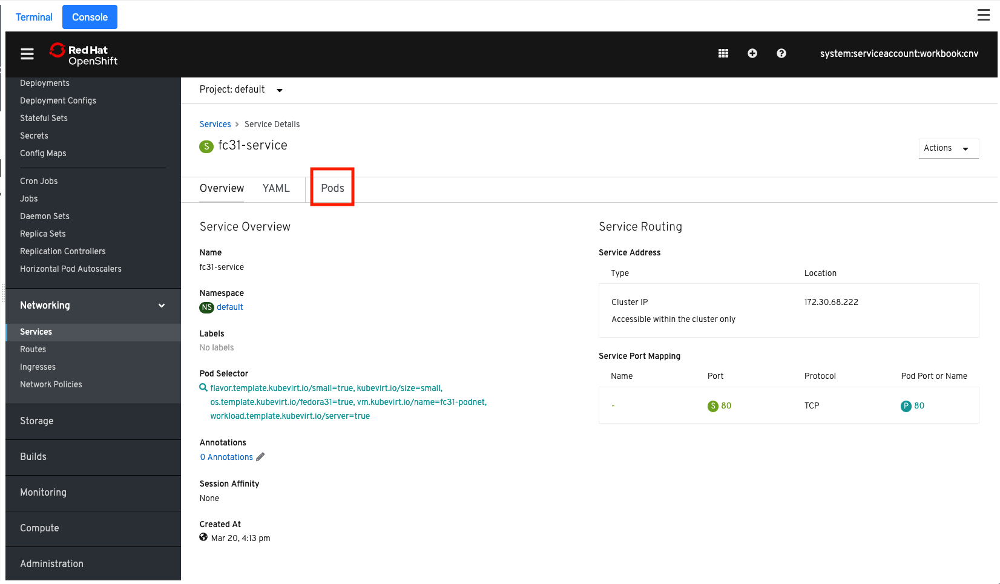

Here we can see the pod that is running the VM instance (the "launcher" pod we learned about previously) as well as the host it is running on:

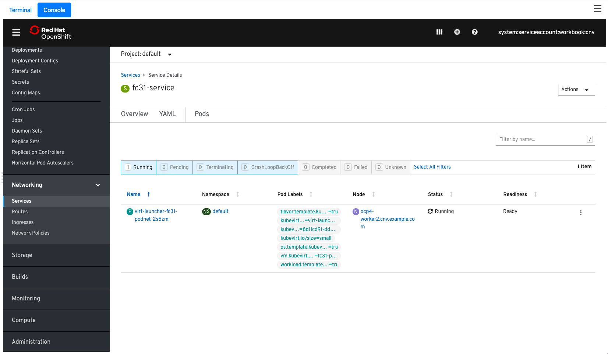

Choose the link for the launcher pod and we can really see the components we built behind the pod. It's important again to note that from here we have access like any other pod in OpenShift. We can use the menu across the top to view the Pod's YAML, Logs, and even access the pod's shell (note this is NOT the VM's shell or console, this is for the pod which **runs** the VM).

Be sure to scroll down on this screen to the Volumes section.

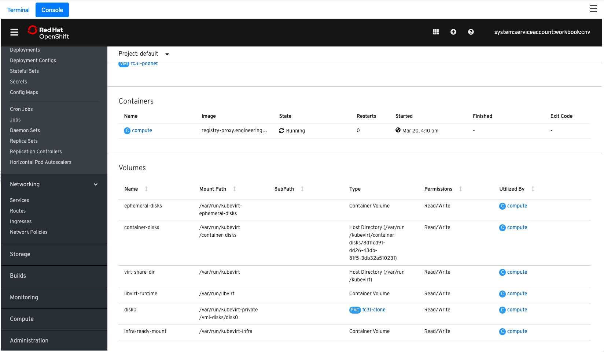

Here we can see all the usual pod constructs, such as volumes and disks, but we also see the mounted disk for the VM it's running: `disk0`. Following on from here, select the link for `disk0` which indicates the type as `PVC fc31-clone`.

Again we are able to see and edit all the features of the PVC we assigned for this pod.

The same is true for all components of our VM's and VMI's from the labs. If you choose any of the storage items from the now-highlighted storage menu on the left you will see. Try choosing "**Storage**" > "**Persistent Volumes**" to show the various PVs we created. Continue to "**Persistent Volume Claims**" and "**Storage Classes**" to complete the picture.

### Launch a VM

Now let's launch a RHEL 8 VM via the UI using the same components we used via the CLI. We first need to delete our original RHEL 8 VM so that we can re-use its disk without causing corruption of the disk. Navigate to "**Workloads**" > "**Virtual Machines**", and delete the "**rhel8-server-nfs**" VM by selecting the three dots on the right hand side and select "**Delete Virtual Machine**" - you'll be asked to confirm.

Now, in the same window select "**Create Virtual Machine**" > "**New with Wizard**":

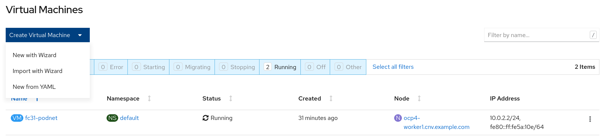

This brings up a an easy to follow wizard to launch the VM:

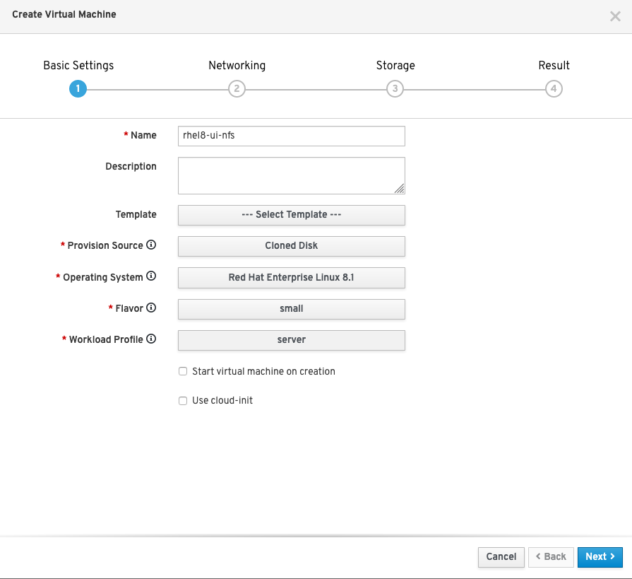

Let's review the choices shown above:

* **Name**: Choose an obvious name, here we just went with "rhel8-ui-nfs"
* **Template**: We don't need to select a template for this VM
* **Source**: Depending what we choose here we can select more in the storage tab. Here we choose "* Disk*" so we can use the rhel8 storage we created earlier.
* **Operating System**: We will use "Red Hat Enterprise Linux 8.1"
* **Flavor**: CLI examples have used "small" so we use it here.
* **Workload Profile**: CLI examples have used "server" so we use it here.

Click "**Next** >" to move to the networking section. Here you will need to click the *3 dots* and remove the default entry (standard pod based networking). We want to create a VM that uses the **tuning-bridge-fixed** configuration (the bridge we previously created) so we can connect to the host's NIC via the bridge as described earlier. Select 'Add Network Interface' and fill in as follows, making sure to select "tuning-bridge-fixed" as the network we want to use. Select add when ready:

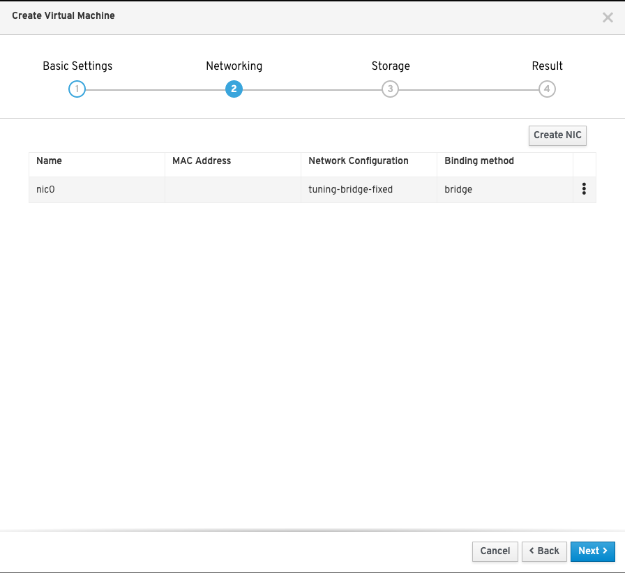

Once you have this set click "**Next >**" to move to the "**Storage**" section. First select "**Attach Disk**" and select the `rhel8-nfs` PVC. If you'll recall this PVC sets the RHEL8 image as an endpoint via CDI:

~~~bash
apiVersion: v1
kind: PersistentVolumeClaim
metadata:
  name: "rhel8-nfs"
  labels:
    app: containerized-data-importer
  annotations:
    cdi.kubevirt.io/storage.import.endpoint: "http://192.168.123.100:81/rhel8-kvm.img"
spec:
  volumeMode: Filesystem
  storageClassName: nfs
  accessModes:
  - ReadWriteMany
  resources:
    requests:
      storage: 40Gi
~~~

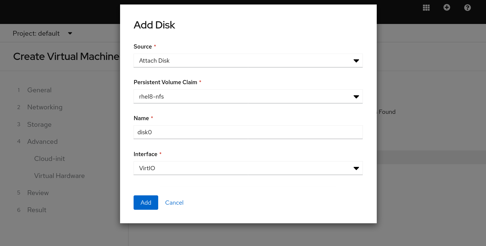

Selecting `rhel8-nfs` will populate the "**Size**" and "**Storage Class**"  fields. Ensure "**Boot Source" is set to "disk0**" (our rhel8-nfs disk):

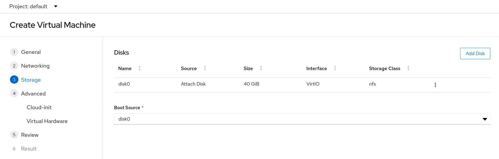

When ready, click "**Review and Create >**" at the bottom. You'll then be able to select "**Create Virtual Machine**". You will (hopefully) see a success message and can review the output of the machine:

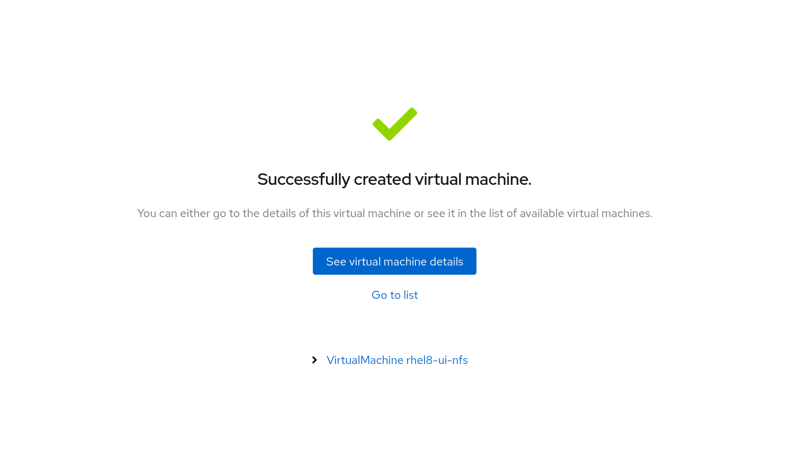

The VM is now ready to be *started* (the default behaviour is to not start the machine after creation). From the "**Workloads > Virtual Machines**" menu choose the *3 dots* menu and select "**Start Virtual Machine**":

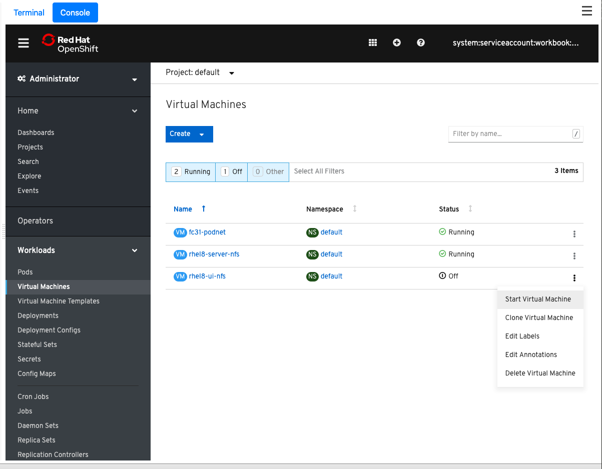

Now the VM *instance* will start. As with the CLI we can also watch the progress via the UI.

After a few minutes (depending on hardware) your instance should report as running:

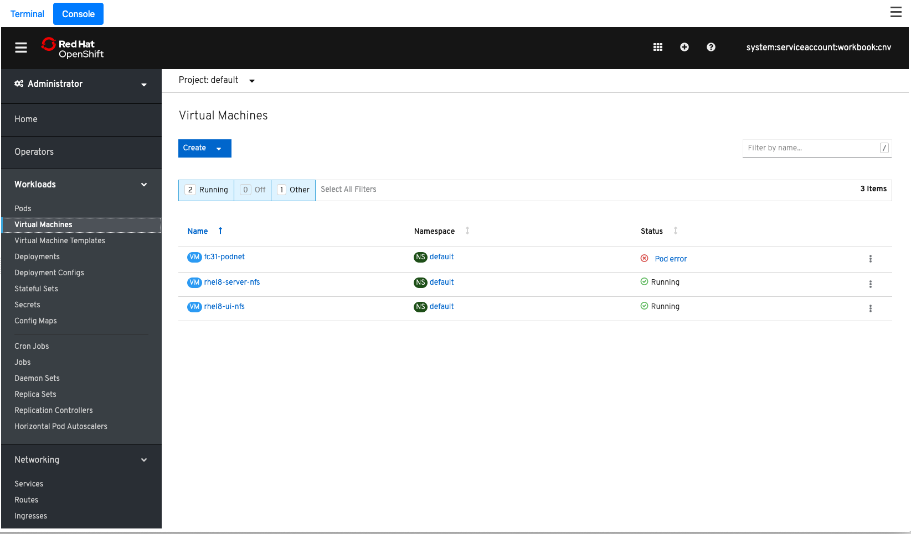

Go ahead and click on the newly running instances name and review the setting. This should look familiar to the CLI-based labs and provide a lot of useful information.

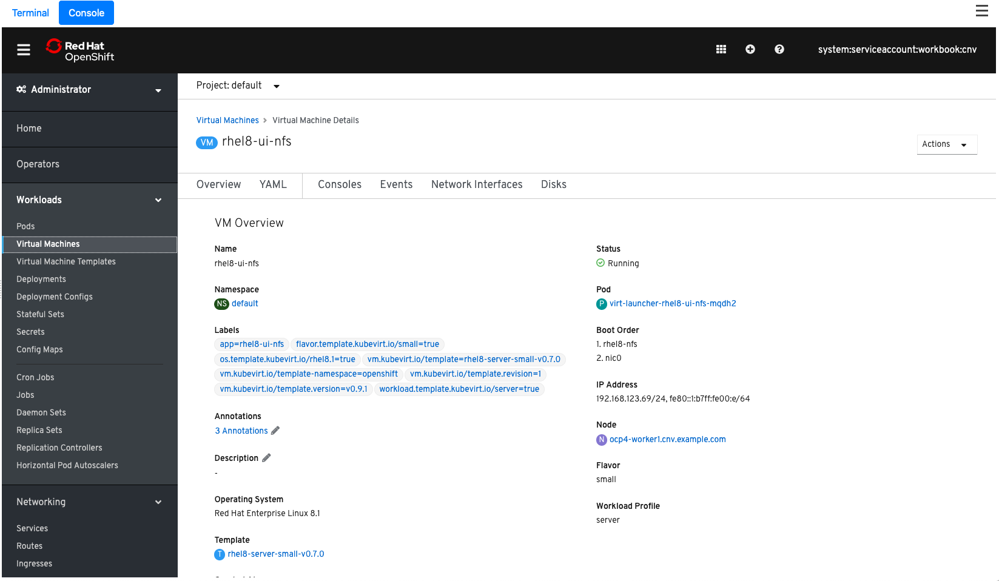

Have a look around the options, but one area worth reviewing is the console. Click on the "**Consoles**" tab. Here you will see a login console. You can choose either VNC or Serial:

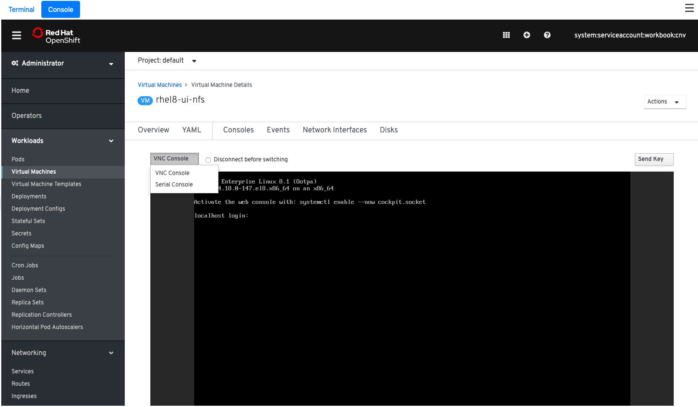

In this example we have chosen serial and logged in as user: `root` password: `redhat`:

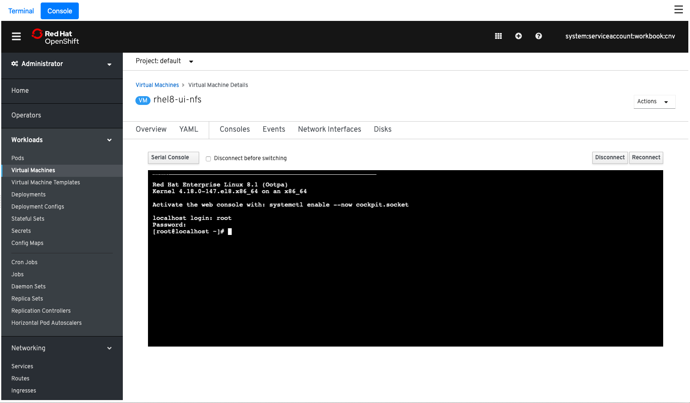

As you know, this is a normal shell and you can now use the VM as normal...

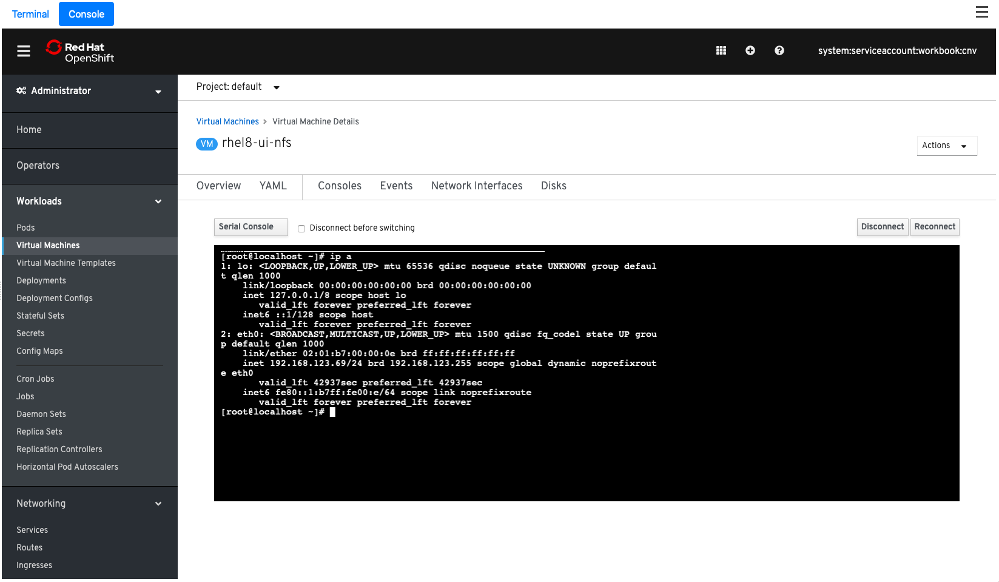

