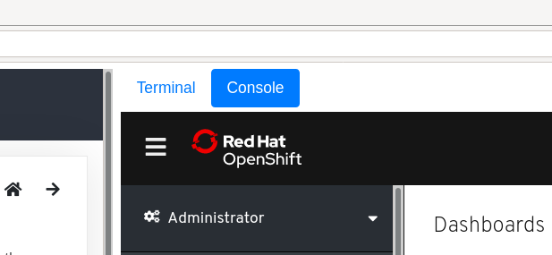
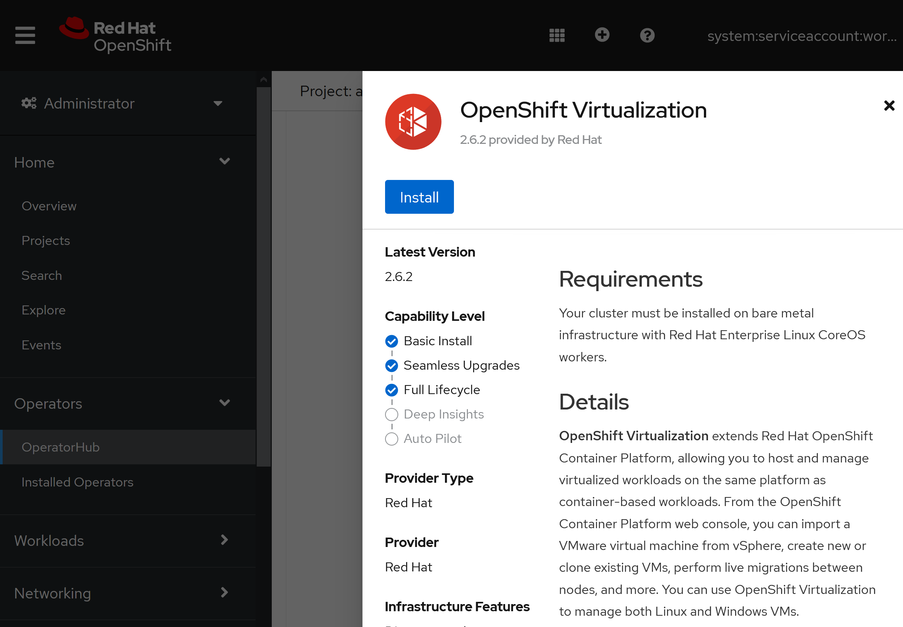
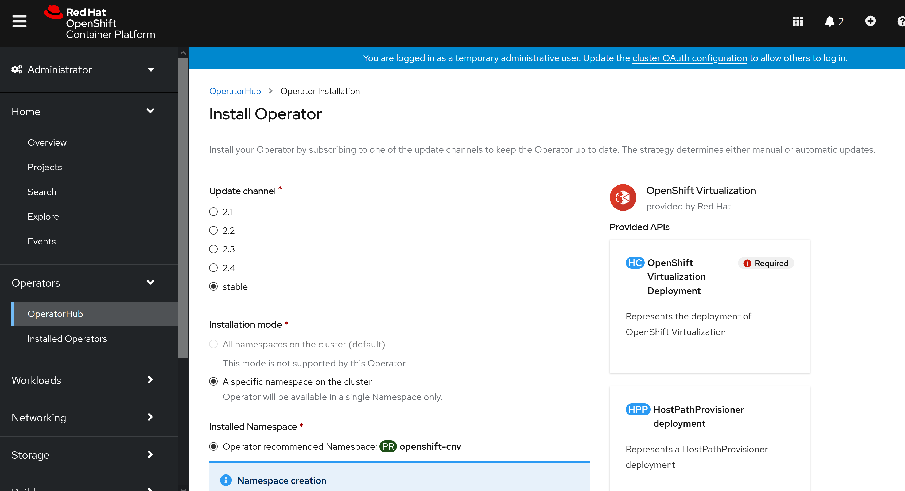
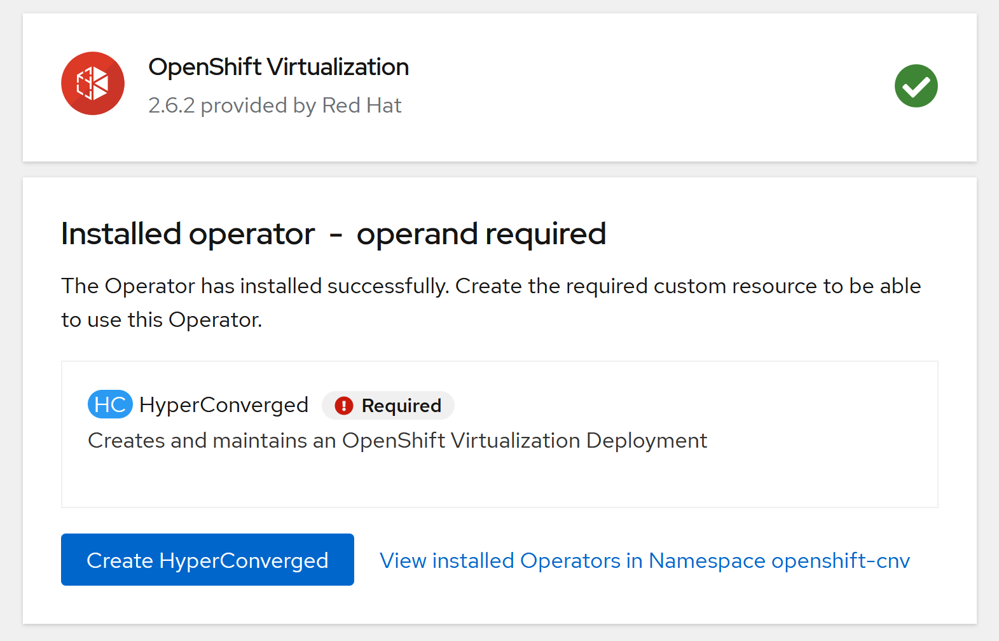
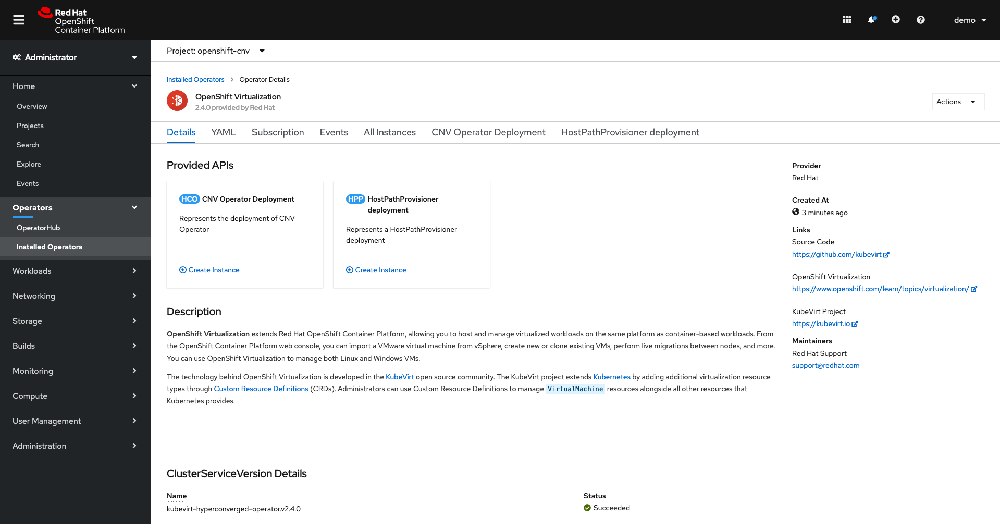
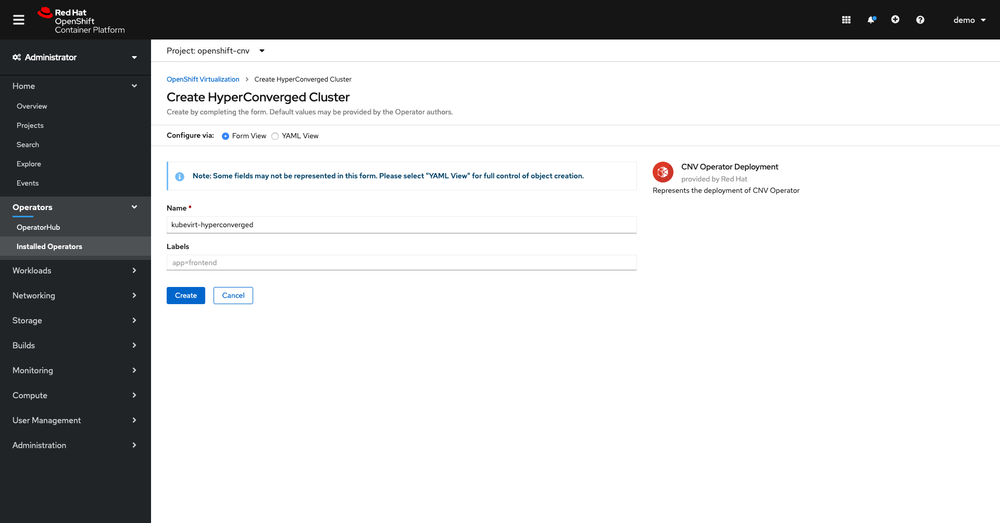
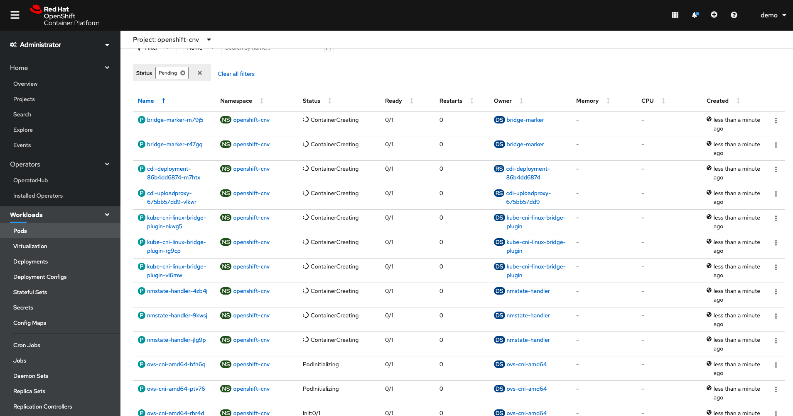
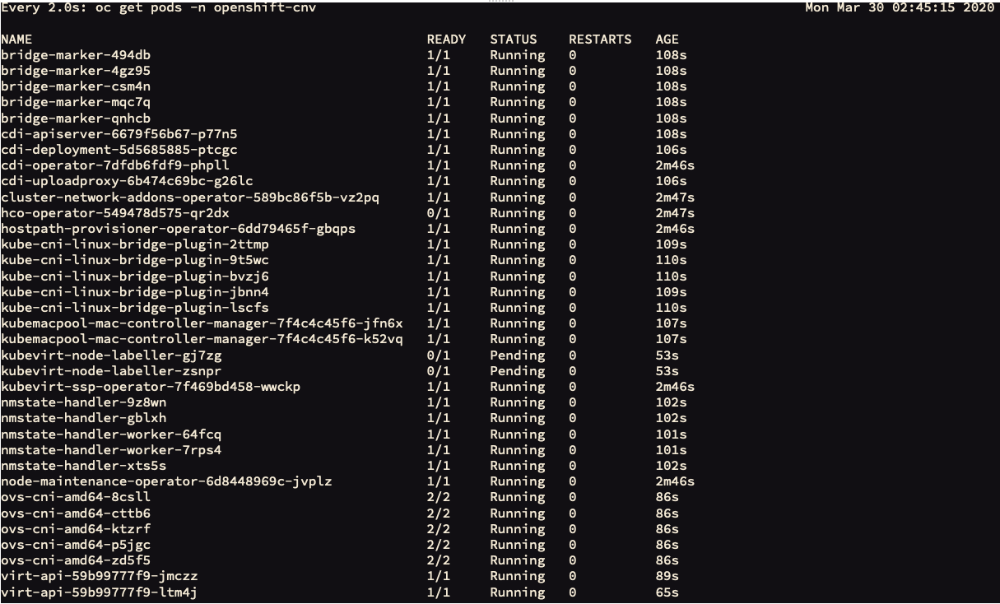
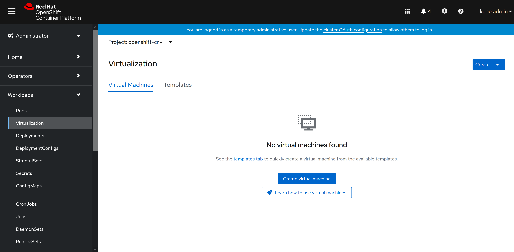

At the time of writing, OpenShift Virtualization is available as both upstream (**KubeVirt**) and downstream releases. **With the release of version 2.4 OpenShift Virtualization is now fully supported by Red Hat!** 

The mechanism for installation is to utilise the operator model and deploy via the OpenShift Operator Hub (Marketplace) in the web-console. Note, it's entirely possible to deploy via the CLI should you wish to do so, but we're not documenting that mechanism here.

From within the lab guide window you'll see a button in the middle at the top that allows you to switch between the terminal and console options. Select the console and you should see the OpenShift dashboard:

> **NOTE**: You can use the dashboard in a separate tab should you wish, you can use this link: https://console-openshift-console.apps.cnv.example.com/dashboards and you'll find the kubeadmin password in */root/ocp-install/auth/kubeadmin-password* on node *192.168.123.100*.

Next, navigate to the top-level '**Operators**' menu entry, and select '**OperatorHub**'. This lists all of the available operators that you can install from the Red Hat Marketplace. Simply start typing '**virtualization**' in the search box and you should see an entry called "Container-native virtualization". Simply select it and you'll see a window that looks like the following:

Next you'll want to select the 'Install' button, which will take you to a second window where you'll be creating an 'Operator Subscription'. Leave the defaults here as they'll automatically select the latest version of OpenShift virtualization and will allow the software to be installed automatically:

Make sure that the namespace it will be installed to is "**openshift-cnv**" - it should be the default entry, but make sure. When you're ready, press the **'Install'** button. After a minute or two you'll see that the subscription has been configured successfully:

Next we need to actually deploy all of the CNV components that this subscription provides. Select the "**OpenShift Virtualization**" link under the '**Name**' column, and you'll be presented with the following:

From here, select '**Create Instance**' on the '**CNV Operator Deployment**' button; this will deploy all of the necessary components that are required to support OpenShift virtualization. The next page will show you the operators details - we can leave this as the defaults and select '**Create**' at the bottom. 

Whilst this does its thing, you can move to the '**Workloads**' --> '**Pods**' menu entry and watch it start all of its resources (select "Pending" from the pods filter):

You can also return to the 'terminal' tab in your hosted lab guide and watch via the CLI:

~~~bash
$ watch -n2 'oc get pods -n openshift-cnv'
(...)
~~~

> **NOTE**: It may take a few minutes for the pods to start up properly. Press **Ctrl+C** to exit the watch command.

During this process you will see a lot of pods create and terminate, which will look something like the following depending on when you view it; it's always changing:

This will continue for some time, depending on your environment.

You will know the process is complete when you can return to the top terminal and see that the operator installation has been successful by running the following command:

~~~bash
$ oc get csv -n openshift-cnv
NAME                                      DISPLAY                    VERSION   REPLACES   PHASE
kubevirt-hyperconverged-operator.v2.4.0   OpenShift Virtualization   2.4.0                Succeeded
~~~

If you do not see `Succeeded` in the `PHASE` column then the deployment may still be progressing, or has failed. You will not be able to proceed until the installation has been successful. Once the `PHASE` changes to `Succeeded` you can validate that the required resources and the additional components have been deployed across the nodes. First let's check the pods deployed in the `openshift-cnv` namespace:

~~~bash
$ oc get pods -n openshift-cnv
NAME                                                 READY   STATUS    RESTARTS   AGE
bridge-marker-h9hgl                                  1/1     Running   0          13m
bridge-marker-j76lr                                  1/1     Running   0          13m
bridge-marker-ljjgr                                  1/1     Running   0          13m
bridge-marker-rf8vj                                  1/1     Running   0          13m
bridge-marker-zxp52                                  1/1     Running   0          13m
cdi-apiserver-7b5894bdbb-77p28                       1/1     Running   0          13m
cdi-deployment-b4f97d69f-ncp22                       1/1     Running   0          13m
cdi-operator-5f9b9c977b-xw7w2                        1/1     Running   0          14m
cdi-uploadproxy-76c94b65c-x25dt                      1/1     Running   0          13m
(...)
~~~

> **NOTE**: All pods shown from this command should be in the `Running` state. You will have many different types, the above snippet is just an example of the output at one point in time, you may have more or less at any one point. Below we discuss some of the pod types and what they do.

Together, all of these pods are responsible for various functions of running a virtual machine on-top of OpenShift/Kubernetes. See the table below that describes some of the various different pod types and their function:

| Pod Name                             | Pod Responsibilities |
| ------------------------------------ | -------------------- |
| *[bridge-marker](https://github.com/kubevirt/bridge-marker)*                      | Marks network bridges as available node resources.|
| *[cdi-*](https://github.com/kubevirt/containerized-data-importer)*                              |  The Containerised Data Importer (CDI) is a Kubernetes extension to populate PVCs with VM disk images or other data. CDI pods allow OpenShift virtualisation to import, upload and clone Virtual Machine images. |
| *[cluster-network-addons-operator](https://github.com/kubevirt/cluster-network-addons-operator)*    | Allows the installation of additional networking plugins. |
| *[hco-operator](https://github.com/kubevirt/hyperconverged-cluster-operator)*                       | Allows users to deploy and configure multiple operators in a single operator and via a single entry point. An "operator of operators." |
| *[hostpath-provisioner-operator](https://github.com/kubevirt/hostpath-provisioner-operator)*      |Operator that manages the hostpath-provisioner, which provisions storage on network filesystems mounted on the host.|
| *[kube-cni-linux-bridge-plugin](https://github.com/containernetworking/plugins)*       |CNI Plugin to create a network bridge and add a host and container to it.|
| *kubemacpool-mac-controller-manager* |Allocation of MAC addresses from a pool to secondary interfaces.|
| *[kubevirt-node-labeller](https://github.com/kubevirt/node-labeller)*             |Creates node labels based on CPU information.|
| *[kubevirt-ssp-operator](https://github.com/MarSik/kubevirt-ssp-operator)*              |Scheduling, Scale and Performance operator for OpenShift. The Hyperconverged Cluster Operator automatically installs the SSP operator when deploying.|
| *nmstate-handler*                    |Deploys NMState which allows network administrators to manage host networking settings in a declarative manner.|
| *[node-maintenance-operator](https://github.com/kubevirt/cluster-network-addons-operator#nmstate)*|Operator that allows the administrator to deploy the NMState State Controller.                    |
| *[ovs-cni](https://github.com/kubevirt/ovs-cni)*|The Open vSwitch CNI plugin.|
| *[virt-api](https://github.com/kubevirt/kubevirt/tree/master/pkg/virt-api)*                           |Kubernetes Virtualization API and runtime in order to define and manage virtual machines|
| *[virt-controller](https://kubernetes.io/blog/2018/05/22/getting-to-know-kubevirt/)*                    |The operator that’s responsible for cluster-wide virtualisation functionality|
| *[virt-handler](https://kubernetes.io/blog/2018/05/22/getting-to-know-kubevirt/)*                       |Tracks changes to a VM's state.|
| *[virt-template-validator](https://kubernetes.io/blog/2018/05/22/getting-to-know-kubevirt/)*            |Add-on to check the annotations on templates and reject them if invalid.|

There's also a few custom resources that get defined too, for example the `NodeNetworkState` (`nns` for short) definitions that can be used with the `nmstate-handler` pods to ensure that the NetworkManager state on each node is configured as required, e.g. for defining interfaces/bridges on each of the machines for connectivity for both the physical machine itself and for providing network access for pods (and virtual machines) within OpenShift/Kubernetes:

~~~bash
$ oc get nns -A
NAME                           AGE
ocp4-master1.cnv.example.com   11m
ocp4-master2.cnv.example.com   12m
ocp4-master3.cnv.example.com   11m
ocp4-worker1.cnv.example.com   12m
ocp4-worker2.cnv.example.com   11m

$ oc get nns/ocp4-worker2.cnv.example.com -o yaml
apiVersion: nmstate.io/v1alpha1
kind: NodeNetworkState
metadata:
  creationTimestamp: "2020-03-09T11:24:42Z"
  generation: 1
  name: ocp4-worker2.cnv.example.com
(...)
   interfaces:
    - ipv4:
        enabled: false
      ipv6:
        enabled: false
      mtu: 1450
      name: br0
      state: down
      type: ovs-interface
    - ipv4:
        address:
        - ip: 192.168.123.105
          prefix-length: 24
        auto-dns: true
        auto-gateway: true
        auto-routes: true
        dhcp: true
        enabled: true
      ipv6:
        address:
        - ip: fe80::dee4:6bcf:a5c7:3cee
          prefix-length: 64
        auto-dns: true
        auto-gateway: true
        auto-routes: true
        autoconf: true
        dhcp: true
        enabled: true
      mac-address: 52:54:00:B2:96:0E
      mtu: 1500
      name: enp1s0
      state: up
      type: ethernet
(...)
~~~

Here you can see the current state of the node (some of the output has been cut), the interfaces attached, and their physical/logical addresses. In a later section we're going to be modifying the network node state by applying a new configuration to allow nodes to utilise another interface to provide pod networking via a **bridge**. We will do this via a `NodeNetworkConfigurationEnactment` or `nnce` in short:

~~~bash
$ oc get nnce -n openshift-cnv
No resources found in openshift-cnv namespace.
~~~

> **NOTE**: As we've not set any additional configuration at this stage, it's perfectly normal to have 'no resources found' in the output above.

### Viewing the OpenShift virtualisation Dashboard

When OpenShift virtualisation is deployed it adds additional components to OpenShift's web-console so you can interact with objects and custom resources defined by OpenShift virtualisation, including `VirtualMachine` types. If you select the `Console` button at the top of this pane you should see the web-console displayed. You can now navigate to "**Workloads**" --> "**Virtualization**" on the left-hand side panel and you should see the new snap-in component for OpenShift virtualisation but with no Virtual Machines running.

> **NOTE**: Please don't try and create any virtual machines just yet, we'll get to that shortly!
