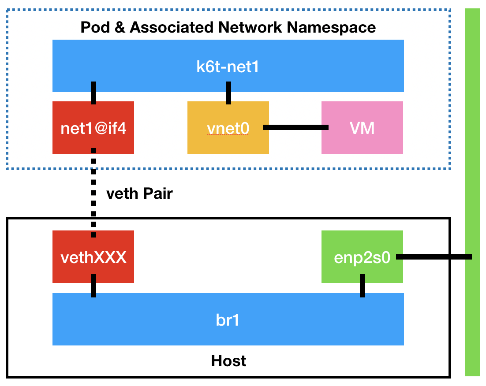

Now let's bring all these settings together and actually launch some workloads!

> **NOTE**: We're calling everything RHEL8 here, regardless of whether you're actually using CentOS 8 as your base image - it won't impact anything for our purposes here.

To begin with let's use the NFS volumes we created earlier to launch some VMs. We are going to create a machine called `rhel8-server-nfs`. As you'll recall we have created a PVC called `rhel8-nfs` that was created using the CDI utility with a RHEL 8 base image. To connect the machine to the network we will utilise the `NetworkAttachmentDefinition` we created for the underlying host's secondary NIC. This is the `tuning-bridge-fixed` interface which refers to that bridge created previously. It's also important to remember that OpenShift 4.x uses Multus as it's default networking CNI so we also ensure Multus knows about this `NetworkAttachmentDefinition`

Lastly we have set the `evictionStrategy` to `LiveMigrate` so that any request to move the instance will use this method. We will explore this in more depth in a later lab.

~~~bash
$ cat << EOF | oc apply -f -
apiVersion: kubevirt.io/v1alpha3
kind: VirtualMachine
metadata:
  annotations:
    name.os.template.kubevirt.io/rhel8: Red Hat Enterprise Linux 8.0
  labels:
    flavor.template.kubevirt.io/small: "true"
    kubevirt.io/os: rhel8
    os.template.kubevirt.io/rhel8: "true"
    template.kubevirt.ui: openshift_rhel8-generic-large
    vm.kubevirt.io/template: rhel8-generic-small
    workload.template.kubevirt.io/generic: "true"
    app: rhel8-server-nfs
  name: rhel8-server-nfs
spec:
  running: true
  template:
    metadata:
      labels:
        vm.kubevirt.io/name: rhel8-server-nfs
    spec:
      domain:
        clock:
          timer:
            hpet:
              present: false
            hyperv: {}
            pit:
              tickPolicy: delay
            rtc:
              tickPolicy: catchup
          utc: {}
        devices:
          disks:
          - disk:
              bus: sata
            name: rhel8-nfs
          interfaces:
          - bridge: {}
            model: e1000
            name: tuning-bridge-fixed
        features:
          acpi: {}
          apic: {}
          hyperv:
            relaxed: {}
            spinlocks:
              spinlocks: 8191
            vapic: {}
        firmware:
          uuid: 5d307ca9-b3ef-428c-8861-06e72d69f223
        machine:
          type: q35
        resources:
          requests:
            memory: 2048M
      evictionStrategy: LiveMigrate
      networks:
        - multus:
            networkName: tuning-bridge-fixed
          name: tuning-bridge-fixed
      terminationGracePeriodSeconds: 0
      volumes:
      - name: rhel8-nfs
        persistentVolumeClaim:
          claimName: rhel8-nfs
EOF

virtualmachine.kubevirt.io/rhel8-server-nfs created
~~~

This starts to **schedule** the virtual machine across the available hypervisors, which we can see by viewing the VM and VMI objects:

~~~bash
$ oc get vm
NAME               AGE   RUNNING   VOLUME
rhel8-server-nfs   4s    false

$ oc get vmi
NAME               AGE   PHASE        IP    NODENAME
rhel8-server-nfs   6s    Scheduling
~~~

> **NOTE**: A `vm` object is the definition of the virtual machine, whereas a `vmi` is an instance of that virtual machine definition.

After a few seconds that machine will show as running:

~~~bash
$ oc get vmi
NAME               AGE   PHASE     IP                  NODENAME
rhel8-server-nfs   2m    Running   192.168.123.62/24   ocp4-worker1.cnv.example.com
~~~

> **NOTE**: You need to have the `qemu-guest-agent` installed in the guest for the IP address to show in this list, and it may take a minute or two to appear.

What you'll find is that OpenShift spawns a pod that manages the provisioning of the virtual machine in our environment, known as the `virt-launcher`:

~~~bash
$ oc get pods
NAME                                   READY   STATUS    RESTARTS   AGE
virt-launcher-rhel8-server-nfs-qntx6   1/1     Running   0          7m

$ oc describe pod/virt-launcher-rhel8-server-nfs-qntx6
Name:         virt-launcher-rhel8-server-nfs-qntx6
Namespace:    default
Priority:     0
Node:         ocp4-worker1.cnv.example.com/192.168.123.104
Start Time:   Tue, 17 Mar 2020 09:19:23 -0400
Labels:       kubevirt.io=virt-launcher
              kubevirt.io/created-by=f6fd33b3-5f2f-45fd-b899-18a089dc44ad
              vm.kubevirt.io/name=rhel8-server-nfs
Annotations:  k8s.v1.cni.cncf.io/networks: [{"interface":"net1","mac":"02:be:83:00:00:00","name":"tuning-bridge-fixed","namespace":"default"}]
              k8s.v1.cni.cncf.io/networks-status:
                [{
                    "name": "openshift-sdn",
                    "interface": "eth0",
                    "ips": [
                        "10.128.2.14"
                    ],
                    "dns": {},
                    "default-route": [
                        "10.128.2.1"
                    ]
                },{
                    "name": "groot",
                    "interface": "net1",
                    "mac": "02:be:83:00:00:00",
                    "dns": {}
                }]
              kubevirt.io/domain: rhel8-server-nfs
Status:       Running
(...)
~~~

If you look into this launcher pod, you'll see that it has the same typical libvirt functionality as we've come to expect with RHV/OpenStack.

First get a shell on the conatiner running pod:

~~~bash
$ oc exec -it virt-launcher-rhel8-server-nfs-qntx6 /bin/bash
~~~

And then you can run the usual virsh commands:

~~~bash
[root@rhel8-server-nfs /]# virsh list --all
 Id   Name                       State
------------------------------------------
 1    default_rhel8-server-nfs   running
~~~

We can also verify the storage attachment, which should be via NFS:

~~~bash
[root@rhel8-server-nfs /]# virsh domblklist 1
 Target   Source
------------------------------------------------------------------
 sda      /var/run/kubevirt-private/vmi-disks/rhel8-nfs/disk.img
 
[root@rhel8-server-nfs /]# mount | grep nfs
192.168.123.100:/nfs/pv1 on /run/kubevirt-private/vmi-disks/rhel8-nfs type nfs4 (rw,relatime,vers=4.2,rsize=524288,wsize=524288,namlen=255,hard,proto=tcp,timeo=600,retrans=2,sec=sys,clientaddr=192.168.123.104,local_lock=none,addr=192.168.123.100)
~~~

And for networking:

~~~bash
[root@rhel8-server-nfs /]# virsh domiflist 1
 Interface   Type     Source     Model   MAC
------------------------------------------------------------
 vnet0       bridge   k6t-net1   e1000   02:9f:1c:00:00:00
~~~

But let's go a little deeper:

~~~bash
[root@rhel8-server-nfs /]# ip link | grep -A2 k6t-net1
5: net1@if4: <BROADCAST,MULTICAST,UP,LOWER_UP> mtu 1500 qdisc noqueue master k6t-net1 state UP mode DEFAULT group default
    link/ether 02:9f:1c:4c:22:7d brd ff:ff:ff:ff:ff:ff link-netnsid 0
6: k6t-net1: <BROADCAST,MULTICAST,UP,LOWER_UP> mtu 1500 qdisc noqueue state UP mode DEFAULT group default
    link/ether 02:9f:1c:4c:22:7d brd ff:ff:ff:ff:ff:ff
7: vnet0: <BROADCAST,MULTICAST,UP,LOWER_UP> mtu 1500 qdisc fq_codel master k6t-net1 state UNKNOWN mode DEFAULT group default qlen 1000
    link/ether fe:9f:1c:00:00:00 brd ff:ff:ff:ff:ff:ff
~~~

That's showing that there's a bridge inside of the pod called "**k6t-net1**", with both the **"vnet0"** (the device attached to the VM), and the **"net1@if4"** device being how the packets get out onto the bridge on the hypervisor (more shortly):

~~~bash
[root@rhel8-server-nfs /]# virsh dumpxml 1 | grep -A8 "interface type"
    <interface type='bridge'>
      <mac address='02:9f:1c:00:00:00'/>
      <source bridge='k6t-net1'/>
      <target dev='vnet0'/>
      <model type='e1000'/>
      <mtu size='1500'/>
      <alias name='ua-tuning-bridge-fixed'/>
      <address type='pci' domain='0x0000' bus='0x02' slot='0x01' function='0x0'/>
    </interface>
~~~

Exit the shell before proceeding:

~~~bash
[root@rhel8-server-nfs /]# exit
exit

$
~~~

Now, how is this plugged on the underlying host? 

The key to this is the **"net1@if4"** device (it may be slightly different in your environment); this is one half of a **"veth pair"** that allows network traffic to be bridged between network namespaces, which is exactly how containers segregate their network traffic between each other on a container host. In this example the **"cnv-bridge"** is being used to connect the bridge for the virtual machine (**"k6t-net1"**) out to the bridge on the underlying host (**"br1"**), via a veth pair. The other side of the veth pair can be discovered as follows. First find the host of our virtual machine:

~~~bash
$ oc get vmi
NAME               AGE   PHASE     IP                  NODENAME
rhel8-server-nfs   10h   Running   192.168.123.62/24   ocp4-worker1.cnv.example.com
~~~

Then connect to it and track back the link - here you'll need to adjust the commands below - if your veth pair on the pod side was **"net1@if4"** then the **ifindex** in the command below will be **"4"**, if it was **"net1@if5"** then **"ifindex"** will be **"5"** and so on...

To do this we need to get to one of our workers, so first jump to the bastion:

~~~bash
$ ssh root@ocp4-bastion
(password is "redhat")

# ssh core@ocp4-worker1
(no password required)

[core@ocp4-worker1 ~]$ export ifindex=4
[core@ocp4-worker1 ~]$ ip -o link | grep ^$ifindex: | sed -n -e 's/.*\(veth[[:alnum:]]*@if[[:digit:]]*\).*/\1/p'
veth1bc05f9b@if5
~~~
> **NOTE**: You may have to adjust both the connection to worker1 or worker2, and the ifindex for the commands above to work properly.

Therefore, the other side of the link, in the example above is **"veth1bc05f9b"**. You can then see that this is attached to **"br1"** as follows-

~~~bash
[core@ocp4-worker1 ~]# ip link show dev veth1bc05f9b
4: veth1bc05f9b@if5: <BROADCAST,MULTICAST,UP,LOWER_UP> mtu 1500 qdisc noqueue master br1 state UP mode DEFAULT group default
    link/ether 62:7c:b2:db:8a:9b brd ff:ff:ff:ff:ff:ff link-netnsid 12
~~~

Note the "**master br1**" in the above output.

Or visually represented:

Exit the worker and baston shells before proceeding:

~~~bash
[core@ocp4-worker1 ~]$ exit
logout
Connection to ocp4-worker1 closed.

[root@ocp4-bastion ~]# exit
logout
Connection to ocp4-bastion closed.

$ oc whoami
system:serviceaccount:workbook:cnv

$ oc project default
Already on project "default" on server "https://172.30.0.1:443".
~~~

Now that we have the NFS instance running, let's do the same for the hostpath setup we created. This is essentially the same as our NFS instance, except we reference the `rhel8-hostpath` PVC:

~~~bash
$ cat << EOF | oc apply -f -
apiVersion: kubevirt.io/v1alpha3
kind: VirtualMachine
metadata:
  annotations:
    name.os.template.kubevirt.io/rhel8: Red Hat Enterprise Linux 8.0
  labels:
    flavor.template.kubevirt.io/small: "true"
    kubevirt.io/os: rhel8
    os.template.kubevirt.io/rhel8: "true"
    template.kubevirt.ui: openshift_rhel8-generic-large
    vm.kubevirt.io/template: rhel8-generic-small
    workload.template.kubevirt.io/generic: "true"
    app: rhel8-server-hostpath
  name: rhel8-server-hostpath
spec:
  running: true
  template:
    metadata:
      labels:
        vm.kubevirt.io/name: rhel8-server-hostpath
    spec:
      domain:
        clock:
          timer:
            hpet:
              present: false
            hyperv: {}
            pit:
              tickPolicy: delay
            rtc:
              tickPolicy: catchup
          utc: {}
        devices:
          disks:
          - disk:
              bus: sata
            name: rhel8-hostpath
          interfaces:
          - bridge: {}
            model: e1000
            name: tuning-bridge-fixed
        features:
          acpi: {}
          apic: {}
          hyperv:
            relaxed: {}
            spinlocks:
              spinlocks: 8191
            vapic: {}
        firmware:
          uuid: 5d307ca9-b3ef-428c-8861-06e72d69f223
        machine:
          type: q35
        resources:
          requests:
            memory: 2048M
      evictionStrategy: LiveMigrate
      networks:
        - multus:
            networkName: tuning-bridge-fixed
          name: tuning-bridge-fixed
      terminationGracePeriodSeconds: 0
      volumes:
      - name: rhel8-hostpath
        persistentVolumeClaim:
          claimName: rhel8-hostpath
EOF

virtualmachine.kubevirt.io/rhel8-server-hostpath created 
~~~

As before we can see the launcher pod built and run:

~~~bash
$ oc get pods
NAME                                        READY   STATUS    RESTARTS   AGE
virt-launcher-rhel8-server-hostpath-nb4bh   1/1     Running   0          18s
virt-launcher-rhel8-server-nfs-l97kd        1/1     Running   0          12m

$ oc get vmi
NAME                    AGE    PHASE     IP                  NODENAME
rhel8-server-hostpath   1m     Running   192.168.123.63/24   ocp4-worker2.cnv.example.com
rhel8-server-nfs        13m    Running   192.168.123.62/24   ocp4-worker1.cnv.example.com

~~~

And looking deeper we can see the hostpath claim we explored earlier being utilised, note the `Mounts` section for where, inside the pod, the `rhel8-hostpath` PVC is attached, and then below the PVC name:

~~~bash
$ oc describe pod/virt-launcher-rhel8-server-hostpath-nb4bh
Name:         virt-launcher-rhel8-server-hostpath-nb4bh
Namespace:    default
Priority:     0
Node:         ocp4-worker2.cnv.example.com/192.168.123.105
Start Time:   Thu, 19 Mar 2020 00:41:29 +0000
Labels:       kubevirt.io=virt-launcher
              kubevirt.io/created-by=1354b779-011a-49bb-8d25-a55fe4d3d20a
              vm.kubevirt.io/name=rhel8-server-hostpath
(...)
    Mounts:
      /var/run/kubevirt from virt-share-dir (rw)
      /var/run/kubevirt-ephemeral-disks from ephemeral-disks (rw)
      /var/run/kubevirt-infra from infra-ready-mount (rw)
      /var/run/kubevirt-private/vmi-disks/rhel8-hostpath from rhel8-hostpath (rw)
      /var/run/kubevirt/container-disks from container-disks (rw)
      /var/run/libvirt from libvirt-runtime (rw)

(...)
Volumes:
  rhel8-hostpath:
    Type:       PersistentVolumeClaim (a reference to a PersistentVolumeClaim in the same namespace)
    ClaimName:  rhel8-hostpath
    ReadOnly:   false
(...)
~~~

If we take a peek inside of that pod we can dig down further, you'll notice that it's largely the same output as the NFS step above, but the mount point is obviously not over NFS:

~~~bash
$ oc exec -it virt-launcher-rhel8-server-hostpath-nb4bh /bin/bash

[root@rhel8-server-hostpath /]# virsh domblklist 1
 Target   Source
-----------------------------------------------------------------------
 sda      /var/run/kubevirt-private/vmi-disks/rhel8-hostpath/disk.img

[root@rhel8-server-hostpath /]# mount | grep rhel8
/dev/mapper/coreos-luks-root-nocrypt on /run/kubevirt-private/vmi-disks/rhel8-hostpath type xfs (rw,relatime,seclabel,attr2,inode64,prjquota)
~~~

The problem here is that if you try and run the `mount` command to see how this is attached, it will only show the whole filesystem being mounted into the pod:

~~~bash
[root@rhel8-server-hostpath /]# mount | grep rhel8
/dev/mapper/coreos-luks-root-nocrypt on /run/kubevirt-private/vmi-disks/rhel8-hostpath type xfs (rw,relatime,seclabel,attr2,inode64,prjquota)
~~~

However, we can see how this has been mapped in by Kubernetes by looking at the pod configuration on the host. First, recall which host your virtual machine is running on, and get the name of the launcher pod:

~~~bash
[root@rhel8-server-hostpath /]# exit
logout

$ oc get vmi/rhel8-server-hostpath
NAME                    AGE     PHASE     IP                  NODENAME
rhel8-server-hostpath   6h40m   Running   192.168.123.63/24   ocp4-worker2.cnv.example.com

$ oc get pods | grep rhel8-server-hostpath
virt-launcher-rhel8-server-hostpath-nb4bh   1/1     Running   0          6h43m
~~~

> **NOTE**: In your environment, your virtual machine may be running on worker1, simply adjust the following instructions to suit your configuration.

Next, we need to get the container ID from the pod:

~~~bash
$ oc describe pod virt-launcher-rhel8-server-hostpath-nb4bh | awk -F// '/Container ID/ {print $2;}'
ba06cc69e0dbe376dfa0c8c72f0ab5513f31ab9a7803dd0102e858c94df55744
~~~

Now we can `ssh` to the worker node via the bastion host, remembering to use the one from the above command:

~~~bash
$ ssh root@ocp4-bastion
(password is "redhat")

# ssh core@ocp4-worker2
(no password required)

[core@ocp4-worker2 ~]$ sudo crictl inspect ba06cc69e0dbe376dfa0c8c72f0ab5513f31ab9a7803dd0102e858c94df55744 | grep -A4 rhel8-hostpath
        "containerPath": "/var/run/kubevirt-private/vmi-disks/rhel8-hostpath",
        "hostPath": "/var/hpvolumes/pvc-77e486ea-af9a-4fb5-bc7d-1f21a59ed21a",
        "propagation": "PROPAGATION_PRIVATE",
        "readonly": false,
        "selinuxRelabel": false
~~~

Here you can see that the container has been configured to have a `hostPath` from `/var/hpvolumes` mapped to the expected path inside of the container where the libvirt definition is pointing to.

Don't forget to exit (twice) before proceeding:

~~~bash
[core@ocp4-worker2 ~]$ exit
logout
Connection to ocp4-worker2 closed.

[root@ocp4-bastion ~]# exit
logout
Connection to 192.168.123.100 closed.

$ oc whoami
system:serviceaccount:workbook:cnv

[~] $ oc project default
Already on project "default" on server "https://172.30.0.1:443".
~~~

