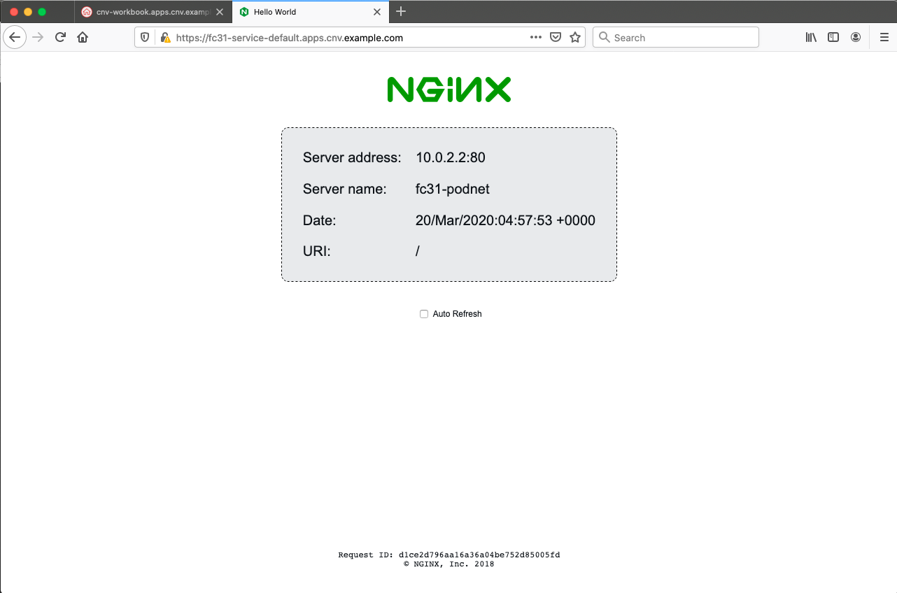

Up to this point we've provisioned our virtual machines on a single bridged network, i.e. just using more traditional networking models; OpenShift 4.x utilises Multus as the default CNI, which permits the user to attach multiple network interfaces from different delegate CNI's simultaneously. One of the models available for OpenShift virtualisation is to provide networking with a combination of attachments, including pod networking, i.e. having virtual machines being attached to the exact same networks that the container pods are attached to too. This has the added benefit of allowing virtual machines to leverage all of the Kubernetes models for services, load balancers, node ports, and a wide variety of other functions.

Pod networking is also referred to as "masquerade" mode when it's related to OpenShift virtualisation, and it can be used to hide a virtual machine’s outgoing traffic behind the pod IP address. Masquerade mode uses Network Address Translation (NAT) to connect virtual machines to the Pod network backend through a Linux bridge. Masquerade mode is the recommended binding method for VM's that need to use (or have access to) the default pod network.

Utilising pod networking rather than the host requires the interface to connect using the `masquerade: {}` method and for IPv4 addresses to be allocated via DHCP. We are going to test this with one of the same Fedora images (or PVC's) we used in the previous labs. In our virtual machine configuration file we need to ensure the following; instruct the machine to use masquerade mode for the interface (there's no command to execute here, just for your information):

~~~
interfaces:
  - name: nic0				      	            
    model: virtio					              
    masquerade: {}
~~~

Connect the interface to the pod network:

~~~bash
networks:
  - name: nic0
    pod: {}
~~~

So let's go ahead and create a `VirtualMachine` using our existing Fedora 31 image via a PVC we created previously. *Look closely, we are using our cloned PVC so we get the benefits of the installed **NGINX** server, qemu-guest-agent and ssh configuration!*

~~~bash
$ cat << EOF | oc apply -f -
apiVersion: kubevirt.io/v1alpha3
kind: VirtualMachine
metadata:
  name: fc31-podnet
  labels:
    app: fc31-podnet
    flavor.template.kubevirt.io/small: 'true'
    os.template.kubevirt.io/fedora31: 'true'
    vm.kubevirt.io/template: fedora-server-small-v0.7.0
    vm.kubevirt.io/template-namespace: openshift
    workload.template.kubevirt.io/server: 'true'
spec:
  running: true
  template:
    metadata:
      labels:
        flavor.template.kubevirt.io/small: 'true'
        kubevirt.io/size: small
        os.template.kubevirt.io/fedora31: 'true'
        vm.kubevirt.io/name: fc31-podnet
        workload.template.kubevirt.io/server: 'true'
    spec:
      domain:
        cpu:
          cores: 1
          sockets: 1
          threads: 1
        devices:
          autoattachPodInterface: false
          disks:
            - bootOrder: 1
              disk:
                bus: virtio
              name: disk0
          interfaces:
            - name: nic0
              model: virtio
              masquerade: {}
          networkInterfaceMultiqueue: true
          rng: {}
        machine:
          type: pc-q35-rhel8.1.0
        resources:
          requests:
            memory: 2Gi
      evictionStrategy: LiveMigrate
      hostname: fc31-podnet
      networks:
        - name: nic0
          pod: {}
      terminationGracePeriodSeconds: 0
      volumes:
        - name: disk0
          persistentVolumeClaim:
            claimName: fc31-clone
EOF
    
virtualmachine.kubevirt.io/fc31-podnet created    
~~~

We can see the Virtual Machine Instance is created on the pod network:

~~~bash
$ oc get vmi/fc31-podnet
NAME               AGE   PHASE     IP                  NODENAME
fc31-podnet        77s   Running   10.128.2.66         ocp4-worker1.cnv.example.com
~~~

**Did you see a 10.128.x.x range of IP?**

Wait about 30 seconds and run the command again.

Has it changed to a 10.0.2.2 IP. And if you were quick enough to see the 10.128 and ping it, it probably worked (be patient, the VM will take some time to come up and respond to ping requests). But the 10.0.2.2 one won't. *Why is this? What's going on?*

Well if you remember correctly we used the cloned fedora image which has the qemu-guest-agent installed. But when we use a `masquerade{}` deployment we are, of course, not interested in the IP assigned to the host. In fact, we are using this so we can use a private, non-routable range and "hide" behind our masqueraded range (the 10.128 range). But the agent is trying to be helpful and is telling OpenShift the IP it *thinks* we want.

So, what do we do?

If you recall, all VMs are managed by pods, and the pod manages the networking. So we can ask the pod associated with the VM for the actual IP ranges being managed here. It's easy ... first find the name of the `launcher` pod associated with this instance:

~~~bash
$ oc get pods | grep fc31-podnet
virt-launcher-fc31-podnet-t9w8w             1/1     Running     0          62m
~~~

Then let's ask check with the *pod* for the actual IPs it is managing for the VM:

~~~bash
 $ oc describe pod/virt-launcher-fc31-podnet-t9w8w | grep -A 11 networks-status
 Annotations:  k8s.v1.cni.cncf.io/networks-status:
                [{
                    "name": "openshift-sdn",
                    "interface": "eth0",
                    "ips": [
                        "10.128.2.56"
                    ],
                    "dns": {},
                    "default-route": [
                        "10.128.2.1"
                    ]
                }]
~~~

As this lab guide is being hosted within the same cluster, you should be able to ping and connect into this VM directly from the terminal window on this IP. And when we connect to the guest we will be able see that the IP assigned to the NIC address is indeed different as it's being masqueraded by the underlying host:

~~~bash
[~] $ ping -c1 10.128.2.27
PING 10.128.2.27 (10.128.2.27) 56(84) bytes of data.
64 bytes from 10.128.2.27: icmp_seq=1 ttl=63 time=1.69 ms

--- 10.128.2.27 ping statistics ---
1 packets transmitted, 1 received, 0% packet loss, time 0ms
rtt min/avg/max/mdev = 1.692/1.692/1.692/0.000 ms

[~] $ ssh root@10.128.2.27
root@10.128.2.27's password:
(password is "redhat")

[root@fc31-podnet ~]# ip a s eth0
2: eth0: <BROADCAST,MULTICAST,UP,LOWER_UP> mtu 1450 qdisc fq_codel state UP group default qlen 1000
    link/ether 02:b1:ce:00:00:05 brd ff:ff:ff:ff:ff:ff
    inet 10.0.2.2/24 brd 10.0.2.255 scope global dynamic noprefixroute eth0
       valid_lft 86309257sec preferred_lft 86309257sec
    inet6 fe80::b1:ceff:fe00:5/64 scope link
       valid_lft forever preferred_lft forever

[root@fc31-podnet ~]# exit
logout
Connection to 10.128.2.27 closed.

$
~~~

And again, if you ask OpenShift for the IP, the qemu-guest-agent supplies the *actual* IP that the VM is set to, just like it's designed to do.

~~~bash
[~] $ oc get vmi/fc31-podnet
NAME          AGE   PHASE     IP            NODENAME
fc31-podnet   74m   Running   10.0.2.2/24   ocp4-worker2.cnv.example.com
~~~

> **NOTE**: If you're not using the guide as part of the self-hosted instructions you'll only be able to access this node directly from that IP if you're connected to one of the CoreOS machines, you can jump to one of those machines from the bastion, but the next instructions will void this requirement.

## Exposing the VM to the outside world

In this step we're going to interface our VM to the outside world using OpenShift/Kubernetes networking constructs, namely services and routes. Before we can do this we need to download the OpenShift virtualisation `virtctl` tool so we can set up the routes for our services. The `virtctl` tool is a CLI-based utility that allows you to interface with an OpenShift virtualisation cluster that bridges some of the gaps between the virtualisation world and the world that Kubernetes was designed for. For example, the `virtctl` tool provides the capability of managing the lifecycle of virtual machines (starting, stopping, restarting, etc), providing access to the virtual consoles, uploading virtual machine images, as well as interfacing with Kubernetes constructs such as services, routes, and alike.

At the moment `virtctl` must be downloaded from the upstream Kubevirt repository as it's not yet packaged in a Red Hat repository or via an RPM, therefore we need to pull it directly:

~~~bash
$ export KUBEVIRT_VERSION=$(curl -s https://api.github.com/repos/kubevirt/kubevirt/releases | grep tag_name | grep -v -- - | sort -V | tail -1 | awk -F':' '{print $2}' | sed 's/,//' | xargs)

$ curl -L -o virtctl https://github.com/kubevirt/kubevirt/releases/download/${KUBEVIRT_VERSION}/virtctl-${KUBEVIRT_VERSION}-linux-amd64
(...)

$ chmod +x virtctl
~~~

>**Note** If you have trouble with the above url's and can't download the virtctl client just go to https://github.com/kubevirt/kubevirt/releases/ and click on the latest release and find the `virtctl-VERSION-rc.1-linux-amd64` file. Copy the link location and download that URL with `curl -L -o virtctl URL`

If you remember, our Fedora 31 image has NGINX running on port 80, let's use the `virtctl` utility to expose the virtual machine instance on that port:

~~~bash
$ ./virtctl expose virtualmachineinstance fc31-podnet --name fc31-service --port 80
Service fc31-service successfully exposed for virtualmachineinstance fc31-podnet

$ oc get svc/fc31-service
NAME            TYPE        CLUSTER-IP      EXTERNAL-IP   PORT(S)   AGE
fc31-service2   ClusterIP   172.30.202.35   <none>        80/TCP    34s
~~~

Next we create a route for our service:

~~~bash
$ oc create route edge --service=fc31-service
route.route.openshift.io/fc31-service created
~~~

And view the route:

~~~bash
$ oc get routes
NAME            HOST/PORT                                    PATH   SERVICES        PORT    TERMINATION   WILDCARD
fc31-service    fc31-service-default.apps.cnv.example.com           fc31-service    <all>   edge          None
~~~

You can now visit the endpoint at [https://fc31-service-default.apps.cnv.example.com/](https://fc31-service-default.apps.cnv.example.com/) in a new browser tab and find the NGINX server from your Fedora based VM.

> **NOTE**: If you get an "Application is not available" message, make sure that you're accessing the route with **https** - the router performs TLS termination for us, and therefore there's not actually anything listening on port 80 on the outside world, it just forwards 443 (OpenShift ingress) -> 80 (pod).

### Via the NodePort service
In this step we're going to further expose our server, but via SSH, and not the web server port. To do that we'll use a `NodePort`, which exposes the service on the underlying worker node's IP, but on a custom port. Let's create a new service via NodePort; in this case we name it `fc31-ssh-node`:

~~~bash
$ ./virtctl expose virtualmachineinstance fc31-podnet --name fc31-ssh-node --type NodePort --port 22
Service fc31-ssh-node successfully exposed for virtualmachineinstance fc31-podnet
~~~

And check which port has been allocated:

~~~bash
$ oc get svc/fc31-ssh-node
NAME            TYPE           CLUSTER-IP      EXTERNAL-IP                            PORT(S)        AGE
fc31-ssh-node   NodePort       172.30.72.188   <none>                                 22:32269/TCP   4s
~~~

In this case our node is accessible on port **32269**. Review which node has been deployed to:

~~~bash
$ oc get vmi/fc31-podnet
NAME               AGE   PHASE     IP                  NODENAME
fc31-podnet        37m   Running   10.0.2.2/24         ocp4-worker2.cnv.example.com
~~~

Now we know which worker it's on we can jump to the VM via the underlying hosts `NodePort`:

~~~bash
$ ssh root@ocp4-worker2.cnv.example.com -p 32269
(password is "redhat")

[root@fc31-podnet ~]# uname -a
Linux fc31-podnet 5.3.7-301.fc31.x86_64 #1 SMP Mon Oct 21 19:18:58 UTC 2019 x86_64 x86_64 x86_64 GNU/Linux
~~~

>  **NOTE**: NodePort services are generally available on *every* host, i.e. just because this was running on *ocp4-worker2* in my environment, we should still be able to ssh to *ocp4-worker1*, as is the beauty of a NodePort, but this is currently subject to a bug: https://github.com/kubevirt/kubevirt/issues/848

Be sure to logout of the VM before proceeding:

~~~bash
[root@fc31-podnet ~]# logout
Connection to ocp4-worker2.cnv.example.com closed.

$
~~~

### Via the cluster IP

We can also create a service to expose port 22 directly on the cluster so we won't need an alternate port. As before expose an ssh service; in this case we name it `fc31-ssh`:

~~~bash
$ ./virtctl expose virtualmachineinstance fc31-podnet --name fc31-ssh --port 22
Service fc31-ssh successfully exposed for virtualmachineinstance fc31-podnet
~~~

We can now see it in our `oc get svc` output:

~~~bash
$ oc get svc/fc31-ssh
NAME            TYPE           CLUSTER-IP       EXTERNAL-IP                            PORT(S)        AGE
fc31-ssh        ClusterIP      172.30.212.222   <none>                                 22/TCP         7s
~~~

We can then connect directly to that cluster IP

> **NOTE**: If you're not using the hosted guide to perform these commands, you'll need to first jump to one of the OpenShift nodes to be able to access this node using the `ClusterIP`.

~~~bash
$ ssh root@172.30.212.222
(password is "redhat")

[root@fc31-podnet ~]#
~~~

**Be sure to logout of all hosts and return to the hosted lab shell before proceeding to the next stage.**

