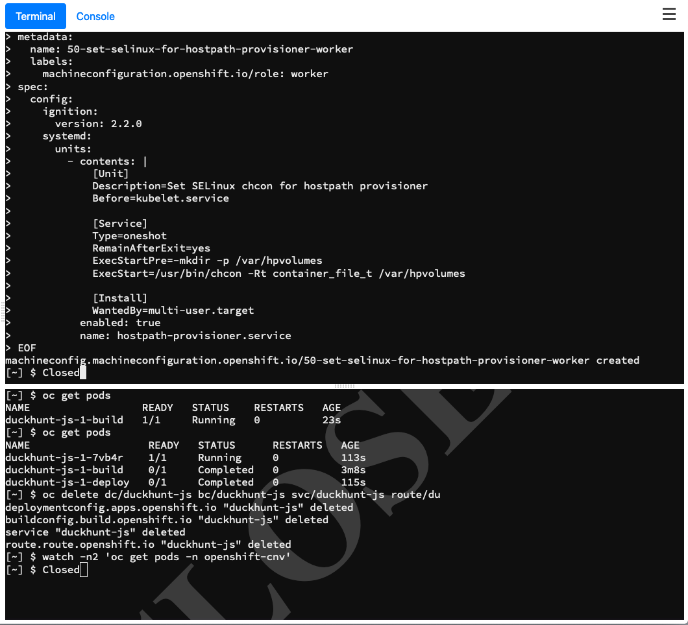
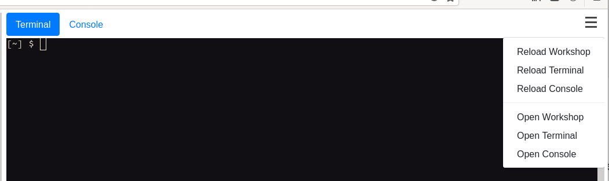

Now that we've got OpenShift virtualisation deployed, let's configure storage. 

First, switch back to the "**Terminal**" view in your lab environment.

We're going to setup two different types of storage in this section, firstly standard NFS shared storage, and also `hostpath` storage which uses the hypervisor's local disks, somewhat akin to ephemeral storage provided by OpenStack.

First, make sure you're in the default project:

~~~bash
$ oc project default
Now using project "default" on server "https://172.30.0.1:443".
~~~

>**NOTE**: If you don't use the default project for the next few lab steps, it's likely that you'll run into some errors - some resources are scoped, i.e. aligned to a namespace, and others are not. Ensuring you're in the default namespace now will ensure that all of the coming lab steps should flow together.

Now let's setup a storage class for NFS backed volumes, utilising the `kubernetes.io/no-provisioner` as the provisioner; to be clear this mean **no** dynamic provisioning of volumes on demand of a PVC:

~~~bash
$ cat << EOF | oc apply -f -
apiVersion: storage.k8s.io/v1
kind: StorageClass
metadata:
   name: nfs
provisioner: kubernetes.io/no-provisioner
reclaimPolicy: Delete
EOF

storageclass.storage.k8s.io/nfs created

$ oc get sc                                                                                                                                            
NAME   PROVISIONER                    RECLAIMPOLICY   VOLUMEBINDINGMODE   ALLOWVOLUMEEXPANSION   AGE                                                       
nfs    kubernetes.io/no-provisioner   Delete          Immediate           false                  14s
~~~

Next we will create two physical volumes (PVs): **nfs-pv1** and **nfs-pv2**:

Create nfs-pv1:

~~~bash
$ cat << EOF | oc apply -f -
apiVersion: v1
kind: PersistentVolume
metadata:
  name: nfs-pv1
spec:
  accessModes:
  - ReadWriteOnce
  - ReadWriteMany
  capacity:
    storage: 40Gi
  nfs:
    path: /nfs/pv1
    server: 192.168.123.100
  persistentVolumeReclaimPolicy: Delete
  storageClassName: nfs
  volumeMode: Filesystem
EOF

persistentvolume/nfs-pv1 created
~~~

Create nfs-pv2:

~~~bash
$ cat << EOF | oc apply -f -
apiVersion: v1
kind: PersistentVolume
metadata:
  name: nfs-pv2
spec:
  accessModes:
  - ReadWriteOnce
  - ReadWriteMany
  capacity:
    storage: 40Gi
  nfs:
    path: /nfs/pv2
    server: 192.168.123.100
  persistentVolumeReclaimPolicy: Delete
  storageClassName: nfs
  volumeMode: Filesystem
EOF

persistentvolume/nfs-pv2 created
~~~

Check the PV's:

~~~bash
$ oc get pv
NAME                    CAPACITY   ACCESS MODES   RECLAIM POLICY   STATUS      CLAIM                                             STORAGECLASS   REASON   AGE
nfs-pv1                 40Gi       RWO,RWX        Delete           Available                                                     nfs                     18s
nfs-pv2                 40Gi       RWO,RWX        Delete           Available                                                     nfs                     12s
openshift-registry-pv   100Gi      RWX            Retain           Bound       openshift-image-registry/image-registry-storage                           13h
~~~

Now let's create a new NFS-based Peristent Volume Claim (PVC). 

For this volume claim we will use a special annotation `cdi.kubevirt.io/storage.import.endpoint` which utilises the Kubernetes Containerized Data Importer (CDI). 

> **NOTE**: CDI is a utility to import, upload, and clone virtual machine images for OpenShift virtualisation. The CDI controller watches for this annotation on the PVC and if found it starts a process to import, upload, or clone. When the annotation is detected the `CDI` controller starts a pod which imports the image from that URL. Cloning and uploading follow a similar process. Read more about the Containerised Data Importer [here](https://kubevirt.io/2018/containerized-data-importer.html).

Basically we are askng OpenShift to create this PVC and use the image in the endpoint to fill it. In this case we use `"http://192.168.123.100:81/rhel8-kvm.img"` in the annotation to ensure that upon instantiation of the PV it is populated with the contents of our specific RHEL8 KVM image.

In addition to triggering the CDI utility we also specify the storage class we created earlier (`nfs`) which is setting the `kubernetes.io/no-provisioner` type as described. Finally note the `requests` section. We are asking for a 40gb volume size which we ensured were available previously via nfs-pv1 and nfs-pv2.

OK, let's create the PVC with all this included!

~~~bash
$ cat << EOF | oc apply -f -
apiVersion: v1
kind: PersistentVolumeClaim
metadata:
  name: "rhel8-nfs"
  labels:
    app: containerized-data-importer
  annotations:
    cdi.kubevirt.io/storage.import.endpoint: "http://192.168.123.100:81/rhel8-kvm.img"
spec:
  volumeMode: Filesystem
  storageClassName: nfs
  accessModes:
  - ReadWriteMany
  resources:
    requests:
      storage: 40Gi
EOF

persistentvolumeclaim/rhel8-nfs created
~~~

Once created, CDI triggers the importer pod automatically to take care of the conversion for you:

~~~bash
$ oc get pods
NAME                   READY   STATUS              RESTARTS   AGE
importer-rhel8-nfs     0/1     ContainerCreating   0          1s
~~~

Watch the logs and you can see the process:

~~~bash
$ oc logs importer-rhel8-nfs -f
I0316 22:15:51.149275       1 importer.go:51] Starting importer
I0316 22:15:51.150113       1 importer.go:107] begin import process
I0316 22:15:51.171501       1 data-processor.go:275] Calculating available size
I0316 22:15:51.173289       1 data-processor.go:283] Checking out file system volume size.
I0316 22:15:51.173513       1 data-processor.go:287] Request image size not empty.
I0316 22:15:51.173537       1 data-processor.go:292] Target size 40Gi.
I0316 22:15:51.174024       1 data-processor.go:205] New phase: TransferDataFile
I0316 22:15:51.177518       1 util.go:170] Writing data...
I0316 22:15:52.174786       1 prometheus.go:69] 2.30
I0316 22:15:53.174905       1 prometheus.go:69] 3.98
I0316 22:15:54.175025       1 prometheus.go:69] 5.64
(...)
I0317 11:46:56.253155       1 prometheus.go:69] 98.24
I0317 11:46:57.253350       1 prometheus.go:69] 100.00
I0317 11:47:00.195494       1 data-processor.go:205] New phase: Resize
I0317 11:47:00.524989       1 data-processor.go:268] Expanding image size to: 40Gi
I0317 11:47:00.878420       1 data-processor.go:205] New phase: Complete
~~~

If you're quick, you can view the structure of the importer pod to get some of the configuration it's using:

~~~bash
$ oc describe pod $(oc get pods | awk '/importer/ {print $1;}')
Name:         importer-rhel8-nfs
Namespace:    default
Priority:     0
Node:         ocp4-worker2.cnv.example.com/192.168.123.105
Start Time:   Wed, 18 Mar 2020 14:27:13 -0400
Labels:       app=containerized-data-importer
              cdi.kubevirt.io=importer
              cdi.kubevirt.io/storage.import.importPvcName=rhel8-nfs
              prometheus.cdi.kubevirt.io=
(...)
   Environment:
      IMPORTER_SOURCE:       http
      IMPORTER_ENDPOINT:     http://192.168.123.100:81/rhel8-kvm.img
      IMPORTER_CONTENTTYPE:  kubevirt
      IMPORTER_IMAGE_SIZE:   40Gi
      OWNER_UID:             63f629f6-963f-4d5b-8eda-e28455cd8999
      INSECURE_TLS:          false
    Mounts:
      /data from cdi-data-vol (rw)
(...)
Volumes:
  cdi-data-vol:
    Type:       PersistentVolumeClaim (a reference to a PersistentVolumeClaim in the same namespace)
    ClaimName:  rhel8-nfs
    ReadOnly:   false
(...)
~~~

Here we can see the importer settings we requested through our claims, such as `IMPORTER_SOURCE`, `IMPORTER_ENDPOINT`, and`IMPORTER_IMAGE_SIZE`. 

Once this process has completed you'll notice that your PVC is ready to use:

~~~bash
$ oc get pvc
NAME        STATUS   VOLUME    CAPACITY   ACCESS MODES   STORAGECLASS   AGE
rhel8-nfs   Bound    nfs-pv2   40Gi       RWO,RWX        nfs            10h
~~~

> **NOTE**: In your environment it may be bound to `nfs-pv1` or `nfs-pv2` - we simply created two earlier for convenience, so don't worry if your output is not exactly the same here. The important part is that it's showing as `Bound`.

This same configuration should be reflected when asking OpenShift for a list of persistent volumes (`PV`), noting that one of the PV's we created earlier is still showing as `Available` and one is `Bound` to the claim we just requested:

~~~bash
$ oc get pv
NAME                    CAPACITY   ACCESS MODES   RECLAIM POLICY   STATUS      CLAIM                                             STORAGECLASS   REASON   AGE
nfs-pv1                 40Gi       RWO,RWX        Delete           Available                                                     nfs                     10h
nfs-pv2                 40Gi       RWO,RWX        Delete           Bound       default/rhel8-nfs                                 nfs                     10h
openshift-registry-pv   100Gi      RWX            Retain           Bound       openshift-image-registry/image-registry-storage                           23h
~~~

Recall that when we setup the `PV` resources we specified the location and path of the NFS server that we wanted to utilise:

~~~basic
  nfs:
    path: /nfs/pv2
    server: 192.168.123.100
~~~

If we have a look on our NFS server we can make sure that it's using this correctly

> **NOTE**: In your environment, if your image was 'pv1' rather than 'pv2', adjust the commands to match your setup. 

~~~bash
$ ssh root@192.168.123.100
(password is 'redhat')

# ls /nfs/pv2 
disk.img

# qemu-img info /nfs/pv2/disk.img
image: /nfs/pv2/disk.img
file format: raw
virtual size: 40G (42949672960 bytes)

# file /nfs/pv2/disk.img
/nfs/pv2/disk.img: DOS/MBR boot sector

# exit
logout
Connection to 192.168.123.100 closed.
~~~

We'll use this NFS-based RHEL8 image when we provision a virtual machine in one of the next steps.

## Hostpath Storage

Now let's create a second storage type based on `hostpath` storage. We'll follow a similar approach to setting this up, but we won't be using shared storage, so all of the data that we create on hostpath type volumes is essentially ephemeral, and resides on the local disk of the hypervisors (OpenShift worker's) themselves. As we're not using a pre-configured shared storage pool for this we need to ask OpenShift's `MachineConfigOperator` to do some work for us directly on our worker nodes.

Run the following in the terminal window - it will generate a new `MachineConfig` that the cluster will enact, recognising that we only match on the worker nodes (`machineconfiguration.openshift.io/role: worker`):

~~~bash
$ cat << EOF | oc apply -f -
apiVersion: machineconfiguration.openshift.io/v1
kind: MachineConfig
metadata:
  name: 50-set-selinux-for-hostpath-provisioner-worker
  labels:
    machineconfiguration.openshift.io/role: worker
spec:
  config:
    ignition:
      version: 2.2.0
    systemd:
      units:
        - contents: |
            [Unit]
            Description=Set SELinux chcon for hostpath provisioner
            Before=kubelet.service

            [Service]
            Type=oneshot
            RemainAfterExit=yes
            ExecStartPre=-mkdir -p /var/hpvolumes
            ExecStart=/usr/bin/chcon -Rt container_file_t /var/hpvolumes

            [Install]
            WantedBy=multi-user.target
          enabled: true
          name: hostpath-provisioner.service
EOF

machineconfig.machineconfiguration.openshift.io/50-set-selinux-for-hostpath-provisioner-worker created
~~~

This deploys a new `systemd` unit file on the worker nodes to create a new directory at `/var/hpvolumes` and relabels it with the correct SELinux contexts at boot-time, ensuring that OpenShift can leverage that directory for local storage. We do this via a `MachineConfig` as the CoreOS machine is immutable. You should first start to witness OpenShift starting to drain the worker nodes and disable scheduling on them so the nodes can be rebooted safely:

~~~bash
$ oc get nodes
NAME                           STATUS                        ROLES    AGE   VERSION
ocp4-master1.cnv.example.com   Ready                         master   16h   v1.17.1+912792b
ocp4-master2.cnv.example.com   Ready                         master   16h   v1.17.1+912792b
ocp4-master3.cnv.example.com   Ready                         master   16h   v1.17.1+912792b
ocp4-worker1.cnv.example.com   Ready                         worker   16h   v1.17.1+912792b
ocp4-worker2.cnv.example.com   NotReady,SchedulingDisabled   worker   16h   v1.17.1+912792b
~~~

> **NOTE**: This will take a few minutes to reflect on the cluster, and causes the worker nodes to reboot. You'll witness a disruption on the lab guide functionality where you will see the consoles hang and/or display a "Closed" image. In some cases we have needed to refresh the entire browser.
>
> 

> It should automatically reconnect but if it doesn't, you can try reloading the terminal by clicking the three bars in the top right hand corner:

When you're able to issue commands again, make sure you're in the correct namespace again:

~~~bash
$ oc project default
Now using project "default" on server "https://172.30.0.1:443".
~~~

Now wait for the following command to return `True` as it indicates when the `MachineConfigPool`'s worker has been updated with the latest `MachineConfig` requested: 

~~~bash
$ oc get machineconfigpool worker -o=jsonpath="{.status.conditions[?(@.type=='Updated')].status}{\"\n\"}"
True
~~~

Now we can set the HostPathProvisioner configuration itself, i.e. telling the operator what path to actually use - the systemd file we just applied merely ensures that the directory is present and has the correct SELinux labels applied to it:

~~~bash
$ cat << EOF | oc apply -f -
apiVersion: hostpathprovisioner.kubevirt.io/v1alpha1
kind: HostPathProvisioner
metadata:
  name: hostpath-provisioner
spec:
  imagePullPolicy: IfNotPresent
  pathConfig:
    path: "/var/hpvolumes"
    useNamingPrefix: "false"
EOF

hostpathprovisioner.hostpathprovisioner.kubevirt.io/hostpath-provisioner created
~~~

When you've applied this config, an additional pod will be spawned on each of the worker nodes; this pod is responsible for managing the hostpath access on the respective host; note the shorter age (42s in the example below):

~~~bash
$ oc get pods -n openshift-cnv | grep hostpath
hostpath-provisioner-operator-55595cb9b7-dsp94        1/1     Running   0          15m
hostpath-provisioner-rvxkk                            1/1     Running   0          42s
hostpath-provisioner-z95lr                            1/1     Running   0          42s
~~~

We're now ready to configure a new `StorageClass` for the HostPath based storage:

~~~bash
$ cat << EOF | oc apply -f -
apiVersion: storage.k8s.io/v1
kind: StorageClass
metadata:
  name: hostpath-provisioner
provisioner: kubevirt.io/hostpath-provisioner
reclaimPolicy: Delete
volumeBindingMode: WaitForFirstConsumer
EOF

storageclass.storage.k8s.io/hostpath-provisioner created
~~~

You'll note that this storage class **does** have a provisioner (as opposed to the previous use of `kubernetes.io/no-provisioner`), and therefore it can create persistent volumes dynamically when a claim is submitted by the user, let's validate that by creating a new hostpath based PVC and checking that it creates the associated PV:

~~~bash
$ cat << EOF | oc apply -f -
apiVersion: v1
kind: PersistentVolumeClaim
metadata:
  name: "rhel8-hostpath"
  labels:
    app: containerized-data-importer
  annotations:
    cdi.kubevirt.io/storage.import.endpoint: "http://192.168.123.100:81/rhel8-kvm.img"
spec:
  volumeMode: Filesystem
  storageClassName: hostpath-provisioner
  accessModes:
  - ReadWriteOnce
  resources:
    requests:
      storage: 40Gi
EOF

persistentvolumeclaim/rhel8-hostpath created
~~~

We use CDI to ensure the volume we're requesting uses a RHEL8 image that we're hosting on a pre-configured web-server on the bastion node, so we expect the importer image to run again:

~~~bash
$ oc get pods
NAME                      READY   STATUS    RESTARTS   AGE
importer-rhel8-hostpath   1/1     Running   0          88s
~~~

> **NOTE**: You can watch the output of this importer pod with `$ oc logs -fimporter-rhel8-hostpath`.  Didn't see any pods? You likely just missed it. To be sure the PV was created continue to the next command.

Once that pod has finished let's check the status of the PV's:

~~~bash
$ oc get pv
NAME                                       CAPACITY   ACCESS MODES   RECLAIM POLICY   STATUS      CLAIM                                             STOR
AGECLASS           REASON   AGE
nfs-pv1                                    40Gi       RWO,RWX        Delete           Available                                                     nfs
                            11h
nfs-pv2                                    40Gi       RWO,RWX        Delete           Bound       default/rhel8-nfs                                 nfs
                            11h
openshift-registry-pv                      100Gi      RWX            Retain           Bound       openshift-image-registry/image-registry-storage
                            24h
pvc-8684d563-4e28-418d-b8c4-aa1b047fb966   79Gi       RWO            Delete           Bound       workbook/rhel8-hostpath                           host
path-provisioner            37m
~~~

> **NOTE**: The capacity displayed above lists the available space on the host, not the actual size of the persistent volume when being used.

Let's look more closely at the PV's. Describe the new hostpath PV (noting that you'll need to adapt for the `uuid` in your environment):

~~~bash
$ oc describe pv/pvc-8684d563-4e28-418d-b8c4-aa1b047fb966
Name:              pvc-8684d563-4e28-418d-b8c4-aa1b047fb966
Labels:            <none>
Annotations:       hostPathProvisionerIdentity: kubevirt.io/hostpath-provisioner
                   kubevirt.io/provisionOnNode: ocp4-worker1.cnv.example.com
                   pv.kubernetes.io/provisioned-by: kubevirt.io/hostpath-provisioner
Finalizers:        [kubernetes.io/pv-protection]
StorageClass:      hostpath-provisioner
Status:            Bound
Claim:             default/rhel8-hostpath
Reclaim Policy:    Delete
Access Modes:      RWO
VolumeMode:        Filesystem
Capacity:          79Gi
Node Affinity:
  Required Terms:
    Term 0:        kubernetes.io/hostname in [ocp4-worker1.cnv.example.com]
Message:
Source:
    Type:          HostPath (bare host directory volume)
    Path:          /var/hpvolumes/pvc-8684d563-4e28-418d-b8c4-aa1b047fb966
    HostPathType:
Events:            <none>
~~~

There's a few important details here worth noting, namely the `kubevirt.io/provisionOnNode` annotation, and the path of the volume on that node. In the example above you can see that the volume was provisioned on *ocp4-worker1.cnv.example.com*, the first of our two worker nodes (in your environment it may have been scheduled onto the second worker). 

Let's look more closely to verify that this truly has been created for us on the designated worker.

> **NOTE**: You may have to substitute `ocp4-worker1` with `ocp4-worker2` if your hostpath volume was scheduled to worker2. You'll need to also match the UUID to the one that was generated by your PVC. 

~~~bash
$ oc debug node/ocp4-worker1.cnv.example.com
Starting pod/ocp4-worker1cnvexamplecom-debug ...
To use host binaries, run `chroot /host`
Pod IP: 192.168.123.104
If you don't see a command prompt, try pressing enter.

sh4.2# chroot /host

sh4.4# ls -l /var/hpvolumes/pvc-8684d563-4e28-418d-b8c4-aa1b047fb966
total 41943044                                                                                                
-rwxr-xr-x. 1 root root 42949672960 Mar 17 08:54 disk.img

sh4.4# file /var/hpvolumes/pvc-8684d563-4e28-418d-b8c4-aa1b047fb966/disk.img
/var/hpvolumes/pvc-8684d563-4e28-418d-b8c4-aa1b047fb966/disk.img: DOS/MBR boot sector

sh4.4# exit
sh4.2# exit
Removing debug pod ...

$ oc whoami
system:serviceaccount:workbook:cnv
~~~

Make sure that you've executed the two `exit` commands above - we need to make sure that you're back to the right shell before continuing, and aren't still inside of the debug pod.
