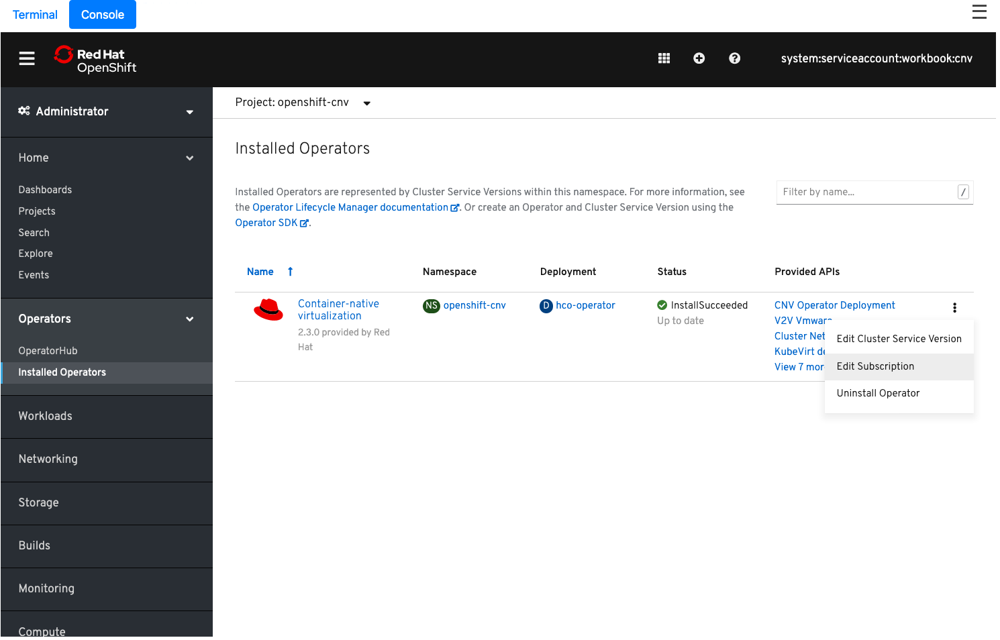
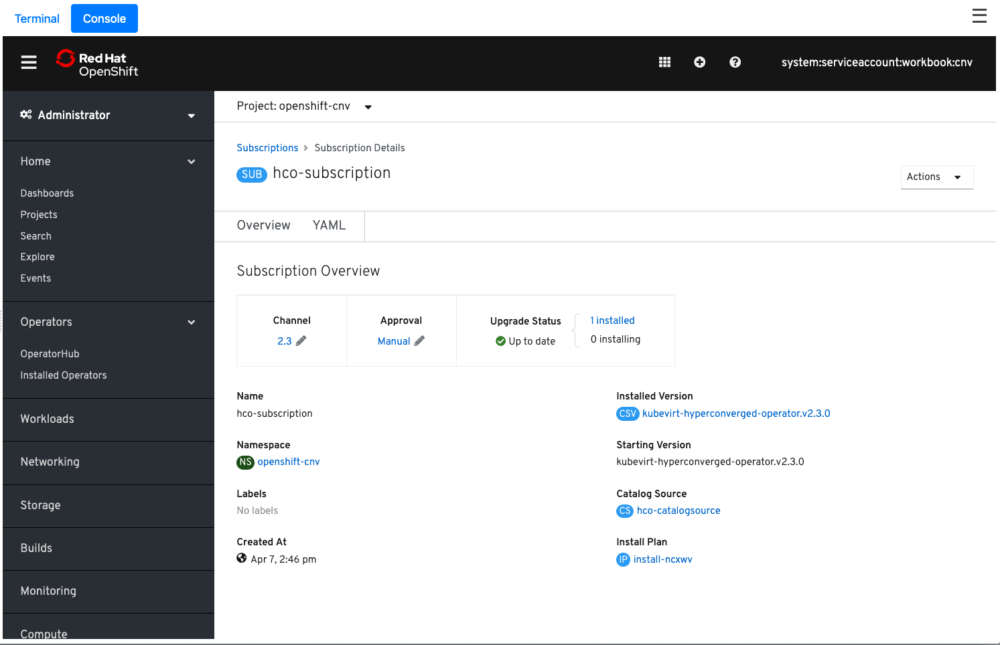
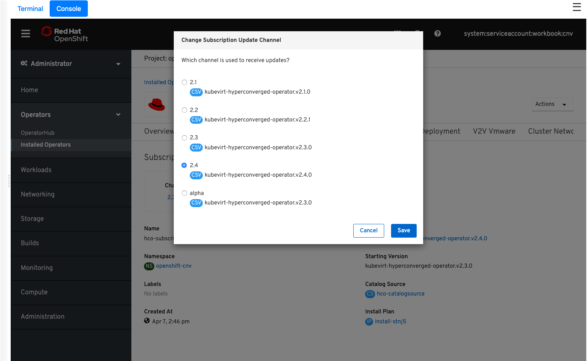
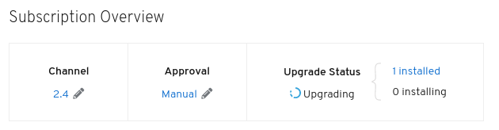
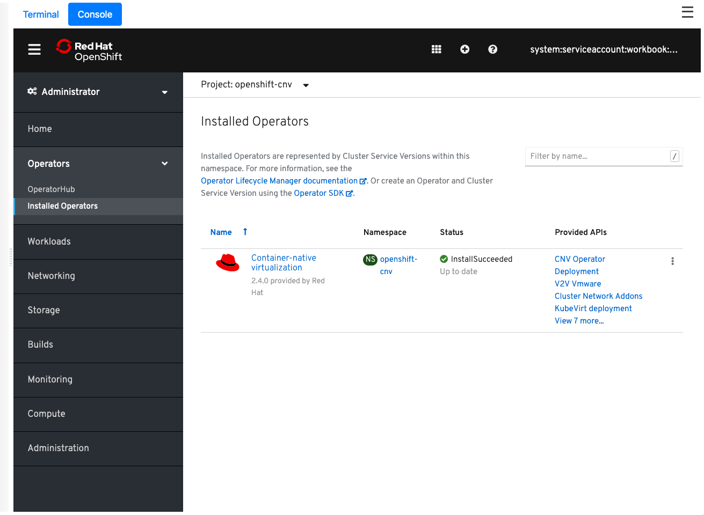
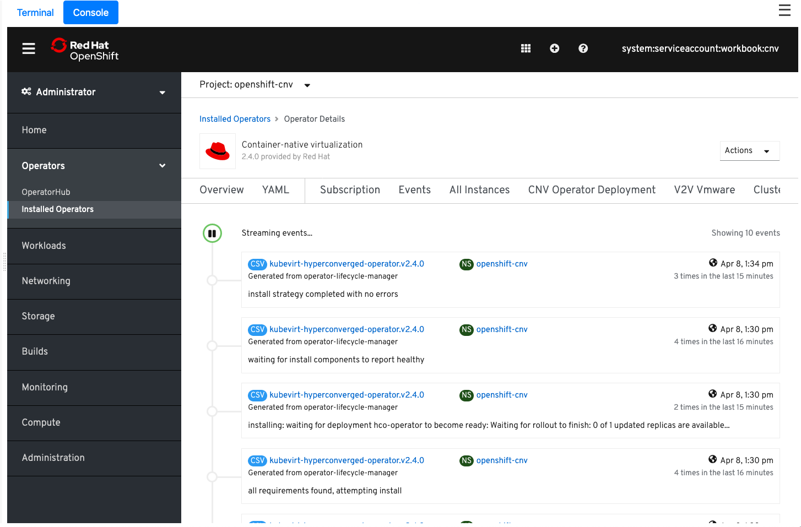

**<u>[Work in Progress]</u>**

In this section we're going to be upgrading OpenShift virtualisation from 2.3 to 2.4 (currently in development). As all of the OpenShift virtualisation install is operator driven we can simply change the version that we're currently subscribed to and it should do all of the rest for us. A word of warning though, the code is in a constant state of flux and may not upgrade successfully, if at all. We've put this at the end of the lab guide merely to show you the typical process that can be expected, understanding that the majority of lab steps should have completed successfully under 2.3, not with the intention of the upgrade itself being successful.

## Upgrading via the UI

The quickest and most efficient way of upgrading OpenShift virtualisation from 2.3 to 2.4 is within the OpenShift Console. At the top window select "**Console**" and then navigate to "**Operators**" > "**Installed Operators**".

You now need to choose the project pulldown at the top of the screen and select "**Project: openshift-cnv**". 

Now, find the vertical dots at the end of the "**Container Native Virtualization**" row, click them and select "**Edit Subscription**".

This defaults to showing you the YAML version of the operator:

And while it's very interesting, the UI provides an excellent way to do an upgrade, so choose the "**Overiew**" option highlighted in the image above.

This brings you to the "**Subscription Details**" page for the operator.

Before we request the upgrade to the operator let's go ahead and switch to automatic approvals for this operator. This means that as soon as a new version is available it will be upgraded as opposed the manual which requires an explicit approvals. Select the *pencil* icon next to the word ""**Manual**" below the "**Approval**" heading. This opens up a simple dialog box where you can choose the "**Automatic (default)**" option:

Now, let's initiate the upgrade. Underneath "**Channel**" you should see "**2.3**" with the little *pencil* icon next to it - click this and you should see the following box pop-up. Ensure you select "**2.4**" and proceed by clicking "**Save**":

You should then have a slightly updated view of the subscription overview, with 2.4 selected and a new "**Upgrade Status**" of "**Upgrading**".

> **NOTE**: This view can change quickly, but the upgrade didn't happen that fast. In fact this process can take some time, so let's watch the pods to see them restarting with their latest versions:

~~~bash
$ watch -n3 'oc get pods -n openshift-cnv'
(...)
~~~

You'll see all the pods go through the various stages of terminating and restarting. In time this should end and all "**STATUS**" entries should be "**Running**".

Now, go back to the Console and choose "**Installed Operators**" again:

The operator version should now read "**2.4 provided by Red Hat**".

Let's go a little deeper. Click on the "**Container-native virtualization**" link and from the resulting "**Operator Details**" page choose "**Events**" along the top.

You can review the entries here to follow the upgrade process in more detail.

Also check out the details on the "**Overview** page. Scroll down and explore!

Finally, go back to the console and query the **ClusterServiceVersion** directly (be sure scroll the output below to the right:

~~~
$ oc get csv -n openshift-cnv
NAME                                      DISPLAY                           VERSION   REPLACES                                  PHASE
kubevirt-hyperconverged-operator.v2.4.0   Container-native virtualization   2.4.0     kubevirt-hyperconverged-operator.v2.3.0   Succeeded
~~~

Neat!

> **NOTE**: As a reminder 2.4 is under development and your environment may not succeed, but this lab is meant to convey the process.

Congrats, you've upgraded your operator and finished the lab, enjoy! 